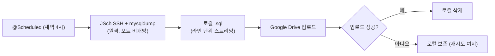
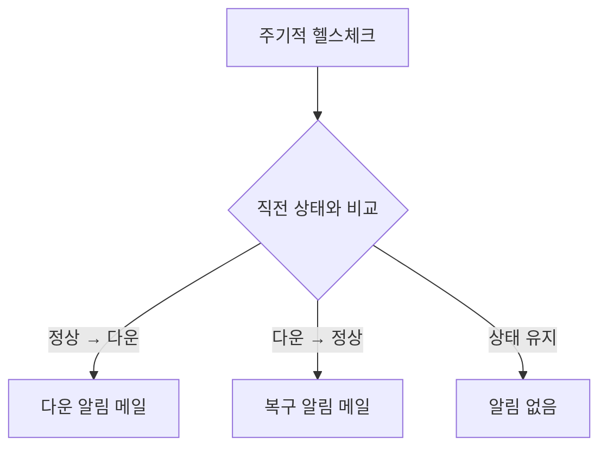

# asnet_dashboard — 운영 자동화 대시보드

> 사내 서버 DB 백업과 서비스 다운 감지를, 지시받은 수동 작업으로 두지 않고 **자발적으로 만든 통합 운영 도구**입니다. 7일 만에 SSH 백업 + 9개 사이트 헬스체크 + 알림까지 묶었습니다.

## 한눈에

| 항목 | 내용 |
|---|---|
| 기간 | 2024.07 (약 7일) |
| 역할 | 단독 — 자발적 사내 도구 |
| 스택 | Java 11 · Spring Boot 2.6 · JSch(SSH) · Google Drive API · Spring Scheduler · JavaMail · Apache Tika |
| 커밋 | 12 (본인 100%) |

두 가지 운영 문제가 배경이었습니다. (1) 노후 사내 서버의 DB 백업이 매번 SSH로 `mysqldump`를 치는 반복 업무로 내려왔고, (2) 덕성여대 산학 시스템(윈도우 서버)이 강제 업데이트 후 자주 다운됐습니다. **두 문제를 한 도구로** 풀었습니다 — 자동 백업과 다운 감지를 묶은 운영 대시보드입니다.

---

## 1. 포트 비개방 원격 DB 백업 — SSH(JSch)로 원격 mysqldump

DB 포트를 외부에 열지 않는 정책이라, 백업하려면 각 서버에 SSH로 들어가 `mysqldump`를 직접 실행해야 했습니다. JSch로 SSH 세션을 열고 `ChannelExec`로 원격 `mysqldump`를 실행한 뒤, 결과 스트림을 `BufferedReader/Writer`로 **라인 단위 스트리밍 저장**해 대용량 DB도 메모리 부담 없이 처리했습니다. 세션·채널은 `finally`에서 닫아 SSH 연결 풀 고갈을 막았습니다.

백업 파일은 Google Drive API(OAuth2, `@PostConstruct`로 앱 시작 시 1회 인증)로 올리고 **업로드가 성공한 뒤에만 로컬에서 삭제**했습니다. MIME 타입은 확장자가 아니라 Apache Tika의 매직넘버 분석으로 감지했습니다.

---

## 2. 사이트 다운 감지 — 상태 전환(edge-trigger) 알림

9개 사이트(덕성여대 산학, 동국대 pshare, tomasedu 등)를 주기적으로 헬스체크했습니다. 처음엔 다운 상태가 유지되는 동안 주기마다 메일이 나가, **한 번 죽으면 수십 통이 쏟아져 오히려 못 보는** 상태가 됐습니다.

필요한 건 "지금 다운"이 아니라 **"상태의 변화"**였습니다. `previousStatus` Map에 직전 상태를 들고 있다가 현재와 비교해 **정상→다운, 다운→정상 전환 시점에만** 메일을 보냈습니다. 상태가 유지되는 동안은 아무것도 보내지 않습니다. 앱 시작 직후 첫 체크는 기록만 하고 비교는 다음 주기부터 해서, 재시작마다 알림이 쏟아지는 false positive도 막았습니다. 알림은 개인·회사 메일로 동시 발송해 야간 장애 때 인지 누락을 줄였습니다.

---

## 3. 차등 백업 스케줄 — 변경 빈도별 매일/월말

모든 DB를 매일 백업할 필요는 없었습니다. 매일 쓰기가 일어나는 `tomas`만 매일 백업하고, 변경이 드문 서비스(dongguk_pshare·newlog·lincplus 등)는 월말 1회로 돌려 백업 트래픽과 Drive 저장 공간을 줄였습니다. 실행 시각은 사용자 트래픽이 가장 낮은 새벽 4시로 잡았습니다.

---

## 잘 됐던 것

**반복 업무를 도구로 만들었습니다.** 백업을 매번 손으로 치는 대신 자동화하고, 거기에 덕성여대 서버 다운 감지까지 통합해 **한 번의 노력으로 두 운영 문제를** 풀었습니다. 지시 범위를 넘어 먼저 움직인 작업이었고, 실제로 서버 장애 때 최신 백업과 조기 감지가 복구 시간을 줄였습니다.

**운영 디테일을 챙겼습니다.** 업로드가 성공한 뒤에만 로컬 삭제, 상태 전환 시점에만 알림, 차등 백업 — 무인 자동화가 조용히 실패하지 않도록 설계했습니다.

**7일간 단계적으로 완성했습니다.** init → 백업 → 업로드 → 통합 → 스케줄러 → MIME 감지 → 알림 순으로, 각 모듈을 검증한 뒤 통합해 디버깅 난이도를 낮췄습니다.

---

## 아쉬운 것 · 다음엔 다르게

**SSH로 원격 접속해 실행하는 구조 자체가 보안상 최선은 아니었습니다.** 한 도구가 모든 서버에 SSH로 들어가 명령을 실행하면, 그 도구 하나에 전 서버의 접속 권한이 모이고 공격 표면도 넓어집니다. 서버마다 내부에서 동작하는 작은 백업 모듈(내부 API)을 하나씩 두고, 각 서버가 자기 DB를 로컬에서 백업해 내부망으로 결과만 올리는 구조였다면 — 원격 SSH 실행도, 권한 집중도 없이 같은 일을 더 안전하게 처리할 수 있었습니다.

**헬스체크가 과했고 얕았습니다.** 9개 사이트에 10초 간격은 과합니다(5분으로 충분하고 외부 부하도 줄어듭니다). 그리고 단순 HTTP 200 체크로는 "200을 주지만 DB가 끊긴" 상태를 못 잡습니다 — 실제 기능을 확인하는 별도 health endpoint가 필요했습니다.

**알림 상태를 인메모리로 들고 있었습니다.** 직전 상태(`previousStatus`)를 메모리 Map에 두는 구조라 인스턴스를 여러 대로 띄우면 상태가 분리됩니다. 사내 단일 인스턴스에선 문제없었지만, 확장한다면 상태를 외부 저장소로 옮겨야 합니다.
