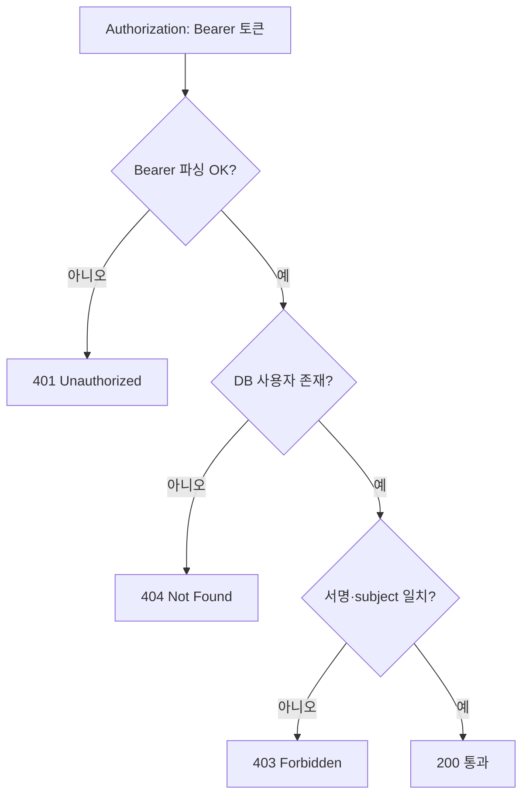
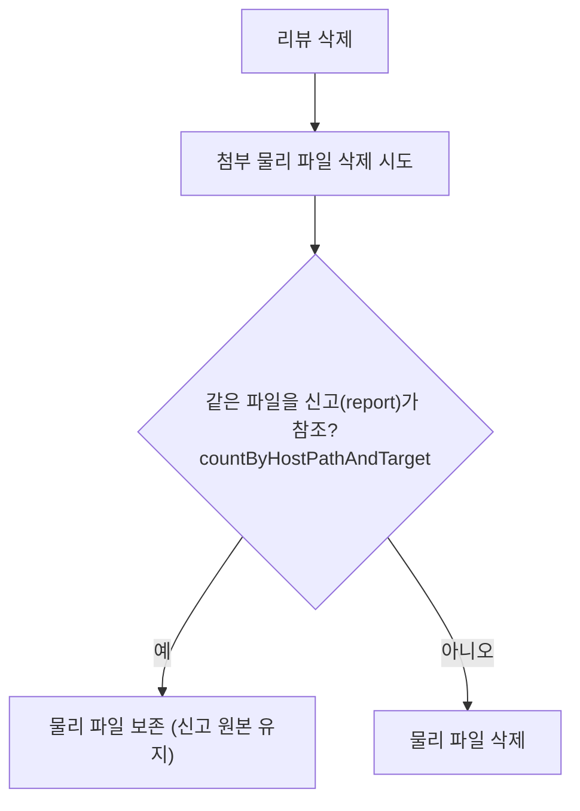
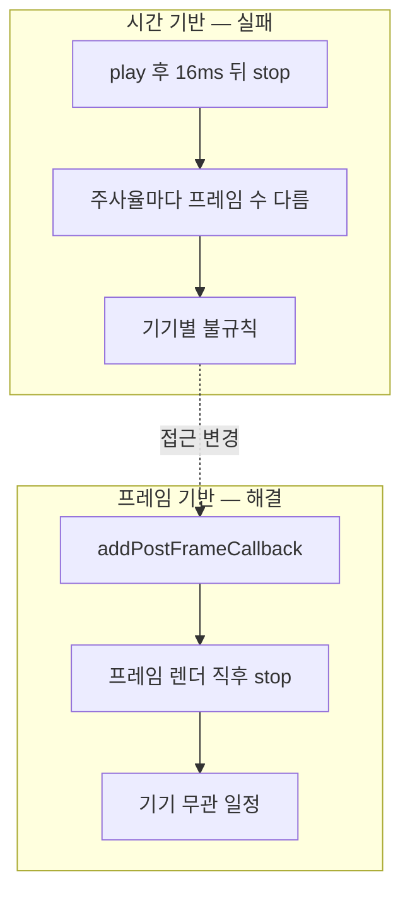

# carsub — 중고차 부품 거래 플랫폼 카썹

> 고객이 폐차장의 중고부품을 직접 구매하고 정비소까지 연결되는 거래 플랫폼입니다. 이미 개발 중이던 프로젝트에 합류해, **인증이 없던 앱 API에 JWT 인증 체계를 붙이고** 리뷰 신고 기능을 신규 설계·구현했습니다.

## 한눈에

| 항목 | 내용 |
|---|---|
| 기간 | 2025.08 ~ 2025.09 |
| 역할 | 팀(3인) — 합류, JWT 인증·리뷰/신고 개발 |
| 스택 | Spring Boot 3.2 · Java 21 · JPA · JJWT · Apache POI / Flutter · Dart |
| 커밋 | 약 12 (본인 기준, admin 7 + app 5) |

합류 시점에 앱이 호출하는 API에 인증이 거의 없었습니다. 짧은 기간이었지만 **인증 체계를 처음부터 세워 전 엔드포인트에 일관되게 적용**하고, 리뷰 신고를 도메인·API·앱 화면까지 직접 만들고, 외부 리뷰 데이터를 옮겨오는 마이그레이션까지 맡았습니다. 아래는 대표 작업 2개이고 나머지는 접어 뒀습니다.

---

## 대표 작업

### JWT 인증 체계 구축 (authenticateAndAuthorize 단일 메서드)

앱이 호출하는 API 상당수가 인증 없이 열려 있었습니다. JJWT 0.12.x로 HS256 토큰 발급·검증을 만들고(`JwtUtill`), 컨트롤러마다 반복되던 검증을 **`authenticateAndAuthorize()` 한 메서드로 캡슐화**했습니다. Bearer 토큰 파싱 → DB 사용자 조회 → 서명·subject 일치 검증을 단계로 흘리고, 실패 원인에 따라 401/403/404를, 통과 시 200을 반환합니다. `int userIdx` / `String userId` 오버로딩으로 두 호출 형태를 모두 받게 했습니다. 미로그인 사용자를 위해선 제한된 권한의 **Guest 토큰**을 발급하는 엔드포인트를 따로 뒀습니다(조회 전용 접근 허용).

앱(Flutter) 쪽도 `Order`·`Request`·`Response`·`Report` 서비스 전 엔드포인트에 `Authorization: Bearer` 헤더를 붙여 서버 체계와 맞췄습니다. 다만 매 호출마다 `SharedPreferences`에서 토큰을 읽는 구조라, 공통 HTTP 인터셉터로 한 번만 읽도록 추상화했어야 했습니다.

### 리뷰 신고 — 원본 스냅샷 + 이미지 참조 카운팅

신고 기능을 설계할 때 **신고된 리뷰가 이후 삭제되면 관리자가 신고 내용을 확인할 수 없는 문제**를 미리 고려했습니다. 두 갈래로 대비했습니다.

**텍스트는 스냅샷으로.** `Report` 엔티티에 `original` 필드를 두어 신고 시점의 원본 내용을 저장했습니다. 원본이 삭제·수정돼도 신고 당시 상태가 남습니다. 신고 대상은 `target` + `target_idx` 범용 구조로 설계해(현재는 "review"만) 다른 도메인으로 확장할 여지를 뒀습니다.

**이미지는 참조 카운팅으로.** 리뷰 첨부 이미지와 신고 원본 이미지가 같은 물리 파일을 가리킬 수 있었습니다. 리뷰 삭제로 물리 파일을 지우면 신고 원본까지 사라집니다. 그래서 첨부 삭제 시 `countByHostPathAndTarget`으로 **같은 파일을 신고가 참조하는지 세어 본 뒤** 삭제 여부를 결정하도록 했습니다.

**왜 원본 테이블이 아니라 신고 도메인에 스냅샷을 뒀나** — 원본에 `is_reported` 플래그를 두고 삭제를 막는 방식도 있지만, 그러면 신고 여부가 원본의 생명주기를 제어해 두 도메인이 결합됩니다. `Report` 안에 스냅샷을 두면 신고 도메인이 **독립적으로** 원본을 보존하고, 원본 삭제 정책을 신고 로직과 분리할 수 있습니다.

---

## 그 외 작업 (펼쳐 보기)

<b>관리자 권한 검증 · 리뷰 일괄 등록 · 클라이언트 버그 · Confetti</b>

### 관리자 권한 검증 (PermissionChecker 중앙화)

각 컨트롤러가 세션을 직접 꺼내 권한을 확인하는 코드가 흩어져 있었습니다. `PermissionChecker`(`@Component`)를 만들어 컨트롤러 첫 줄의 `permissionChecker.isRole(AdminRole.ADMIN)` 한 줄로 권한 확인 + 미인가 시 로그인 리다이렉트를 모았습니다. 싱글톤 빈에서 `RequestContextHolder`로 `HttpServletRequest`를 파라미터 없이 접근했고, 역할은 `AdminRole`(SUPER·ADMIN) enum으로 명시했습니다(SUPER가 모든 권한을 포함한다는 규칙은 `SessionUser.isRole()` 한 곳에 집중). 미인가 시 가려던 URL을 세션에 보관해 로그인 후 복귀시켰습니다 — Spring Security의 `SavedRequestAware...`를 수동 구현한 셈입니다. (돌아보면 Spring Security를 쓰는 게 더 나았습니다 — 아래 '아쉬운 것'.)

### 리뷰 엑셀 일괄 등록 (다중 날짜 포맷 + 원격 이미지)

기존 리뷰 데이터를 엑셀로 받아 적재해야 했습니다. Apache POI로 `.xlsx`를 파싱하는데 까다로운 건 **날짜**였습니다 — 숫자 직렬화·ISO-8601(UTC)·오프셋·로컬 등 제각각이라, 셀 타입을 먼저 보고(`NUMERIC && DateUtil.isCellDateFormatted()`) 아니면 문자열 포맷으로 폴백하는 `parseExcelDate()`로 처리했습니다. 이미지 URL은 `RemoteFileFetcher`로 내려받아 `SimpleMultipartFile`(MultipartFile을 byte 배열로 구현)로 감싸 **기존 업로드 서비스에 그대로 주입**했습니다. 원본 작성일을 살리려 `@CreationTimestamp`를 떼고 날짜를 직접 주입했습니다(대신 일반 등록 시 누락 주의라는 트레이드오프가 생깁니다).

### 그 외 클라이언트 버그·정합성

- **Provider 초기 상태 `0 → 1`** — 캐시 우선(`0`)이 기본이라 최초 설치 시 빈 데이터로 오류가 났습니다. "항상 서버 요청"으로 초기화했습니다.
- **서버 plain text 응답 방어** — 첨부 삭제 API가 평문을 반환할 때 `jsonDecode`가 터져, `{'code':200,'message':body}`로 감싸 방어하고 결과를 `Future<bool>`로 올렸습니다.
- **EndPoint URL 오타** (`/review/user/list` → `/review/list/user`) — 서버-클라이언트 불일치는 런타임에야 드러납니다.
- **부품 구분자 표시** — 서버가 `@@`로 직렬화한 목록이 화면에 노출돼 UI에서 `", "`로 치환했습니다.

### Confetti 기기별 표시 불일치 (SchedulerBinding 프레임 제어)

회원가입 완료(`signup_done.dart`) 화면의 Confetti가 **기기별로 불규칙하게** 표시됐습니다. `emissionFrequency`가 "방출 빈도"가 아니라 **프레임마다 방출할 확률**이라 주사율(60/90/120Hz)에 따라 달라지는 것이었습니다. `16ms` 시간 기반도 실패해서 — `SchedulerBinding.addPostFrameCallback()`으로 **프레임 렌더 직후 `stop()`**을 호출해 기기 무관 일정해졌습니다. 값 조정이 아니라 **라이브러리 내부 동작을 이해해야** 풀리는 문제였습니다.

---

## 잘 됐던 것

**합류 직후 인증 체계를 세워 일관되게 적용했습니다.** 검증 로직을 `authenticateAndAuthorize()` 하나로 공통화해 전 엔드포인트에 같은 방식으로 적용했습니다 — 공통화 비용이 적용 단계에서 회수됐습니다.

**신고 기능을 DB·API·앱 화면까지 설계했습니다.** "삭제돼도 내용이 남아야 한다"는 요구를 텍스트 스냅샷 + 이미지 참조 카운팅 두 갈래로 풀었습니다.

**외부 데이터 마이그레이션을 기존 자산을 재사용해 처리했습니다.** 원격 이미지를 `SimpleMultipartFile`로 감싸 기존 업로드 서비스에 흘려보냈습니다.

---

## 아쉬운 것 · 다음엔 다르게

**권한 검증은 직접 만들기보다 Spring Security를 썼어야 했습니다.** `PermissionChecker`는 동작했지만 권한 정책이 컨트롤러에 흩어진 구조를 그대로 가져갑니다. 합류 시엔 표준을 먼저 검토하는 게 맞습니다.

**앱에 공통 HTTP 인터셉터가 없었습니다.** 매 호출마다 토큰 헤더를 수동으로 붙이는 구조라 누락 위험이 있었습니다. 인터셉터로 인증·에러 처리를 모았어야 했습니다.
