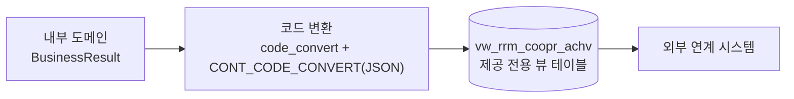
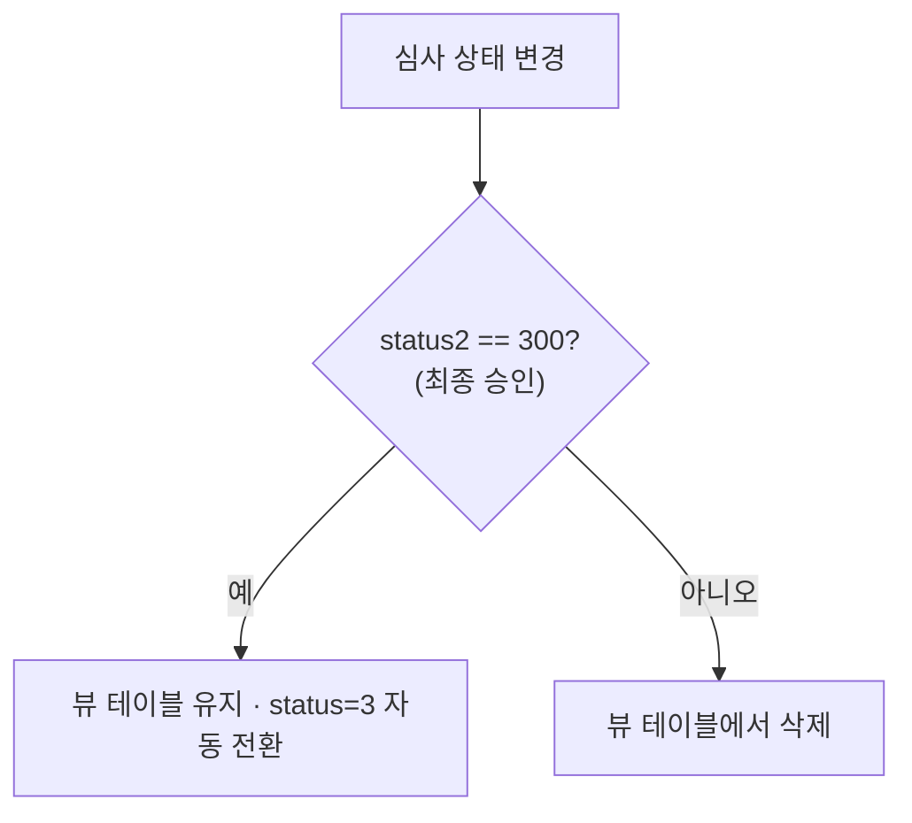

# duksung_rnd — 덕성여대 산학협력단 포털

> 교수·연구자의 산학협력 실적을 등록·심사하고 외부 연계 시스템에 제공하는 산학협력단 포털입니다. 기존 담당자에게 이어받아 약 1.5년간 프론트엔드 구현·백엔드 개발을 맡아 운영·고도화했습니다(디자인 제외).

## 한눈에

| 항목 | 내용 |
|---|---|
| 기간 | 2024.03 ~ 2025.08 |
| 역할 | 팀(3인) — 프론트엔드 구현·백엔드 개발, 점차 메인 담당 |
| 스택 | Java · Spring Boot · Spring Security · JPA · Thymeleaf · MySQL · GitLab |
| 커밋 | 103 (본인 기준) |
| 도메인 | 산학협력 실적, 사업공모 신청·심사, 가족기업, 공용장비 신청, 재직자 교육, QR 인증, 권한 관리 |

기존 담당자가 구축한 시스템에 합류해 점차 메인 담당을 맡았습니다(별도의 Oracle 연계 API `duksung_api`도 초기 구성했습니다). 가장 무게 있는 작업은 **외부 시스템 연계(뷰 테이블 + 코드 변환 계층)**, **접근제어(IDOR) 체계적 패치**, **산학실적 심사 워크플로우** 셋이고, 나머지는 접어 뒀습니다.

---

## 1. 외부 시스템 연계 — 뷰 테이블 + 코드 변환 계층

산학협력 실적을 외부 연계 시스템에 제공해야 했는데, 외부가 기대하는 컬럼 명세(`ACHIEV_CODE`, `EVAL_CODE`, `CONT_1~15` …)가 내부 도메인 구조와 달랐습니다. 게다가 그 코드값은 외부 정책에 따라 언제든 바뀔 수 있었습니다.

내부 도메인을 외부 스펙에 직접 맞추면 외부가 바뀔 때마다 도메인·쿼리가 흔들립니다. 그래서 **둘 사이에 변환 계층을 뒀습니다**. 제공 전용 뷰 테이블(`vw_rrm_coopr_achv`)을 따로 설계하고, 내부 코드 ↔ 외부 코드 매핑을 `code_convert` 테이블과 `common` 테이블의 JSON 코드맵(`CONT_CODE_CONVERT`)으로 관리했습니다. 변환은 런타임에 이 매핑을 읽어 처리하므로, **코드값이 바뀌어도 소스 수정·재배포 없이 DB만 고치면 됐습니다.**

특히 지식재산권처럼 입력 항목이 많은 카테고리는 `CONT_1~15` 필드 매핑이 복잡했는데, 하드코딩 문자열이던 것을 `common` 테이블의 JSON을 읽어 중첩 `Map`으로 파싱·변환하도록 바꿨습니다. 카테고리마다 구조가 다른 문제를 **코드 분기가 아니라 데이터로** 풀어낸 셈입니다.

뷰 테이블은 "최종 승인된 실적"만 담아야 했습니다. 심사 저장 시 **`status2`가 300(최종 승인)이 아니면 뷰 테이블에서 레코드를 삭제**하는 이벤트 동기화로 두 테이블 일관성을 상태 변경 시점에 능동적으로 유지했습니다.

---

## 2. IDOR(URL idx 변조) — 전 도메인 소유권 검증

합류 직후, URL의 `idx` 파라미터만 바꾸면 다른 사람의 공용장비 신청·사업공모 신청·인증서를 열람할 수 있는 취약점을 다수 발견했습니다. 인증(로그인)은 있어도 **인가(소유권 검증)가 빠져 있던** 전형적인 IDOR였습니다.

한 곳만 막는 게 아니라 **같은 패턴을 전 도메인에 전파**했습니다 — 공용장비(`MypageRentController`) → 사업공모(`MypageBusiness/ResultController`) → 접수 성공·기간 만료(`BizController`) → 인증서·협약서 출력(`CoopController`) 순으로, 세션 사용자와 데이터 소유자를 대조해 불일치 시 차단했습니다. 출력·다운로드 엔드포인트도 예외 없이 적용했습니다 — "보기만 하는 것"도 민감정보 노출이기 때문입니다. SSO 로그인(`DuksungSsoAuthenticationProvider`)에는 이메일 중복 가입 방지도 함께 넣었습니다.

돌아보면 비즈니스 규칙(접수 기간 만료)과 보안(IDOR)을 컨트롤러에서 섞어 처리한 건 아쉽습니다 — 규칙은 서비스에서 예외로, 컨트롤러는 redirect만 맡는 게 더 깔끔했을 것입니다.

---

## 3. 산학실적 심사 워크플로우 (상태 캡슐화 + 이력 추적)

**같은 상태를 관리자와 교수에게 다르게.** 심사 상태 코드(`status` 1·2·3·9 / `status2` 100·200·300)가 정수로 흩어져 있었고, 관리자는 단계별로 상세히·교수에게는 "심사중" 하나로 보여야 했습니다. 변환 로직을 뷰·컨트롤러에 흩지 않고 **도메인 메서드로 캡슐화**했습니다 — `status2TextToUser()`, `status2BadgeClassTextToUser()` 등. 코드값이 바뀌어도 한 곳만 고치면 됩니다.

**수정 이력 audit trail.** 심사 결과를 수정할 때마다 누가·언제·어떤 상태로 바꿨는지를 `BusinessEvaluation`에 기록했습니다(별도 audit 테이블 대신 평가 테이블 재사용). `status2`가 300에 도달하면 `status`를 3으로 자동 전환해 흐름을 닫았습니다.

**외부 입력값 방어.** 승인점수가 "미정" 같은 비숫자로 들어오는 경우가 있어서, `Optional` + 정규식으로 null·빈값·비숫자를 거른 뒤 `BigDecimal`로 안전 변환했습니다.

---

## 그 외 작업 (펼쳐 보기)

<b>데이터 정합성 · 운영 안정성</b> (탈퇴 이름 스냅샷 · 장비명 검색 · 서버 다운 감지 도구)

### 탈퇴 교수 이름 유실 — userName 스냅샷 컬럼

실적 목록·상세에서 신청자 이름을 `user` 조인으로 가져왔는데, 교수가 탈퇴하면 이름이 사라졌습니다. `businessresult`에 `userName` 컬럼을 추가해 **등록·수정 시점의 이름을 스냅샷으로 저장**하고, 이후 표시는 조인 대신 그 컬럼에서 읽도록 바꿨습니다. 이력성 데이터는 원본이 바뀌거나 사라져도 당시 상태를 보존해야 합니다.

### 장비명 검색 추가 — countQuery 정합성 유지

공용장비 검색이 신청자 이름만 대상이라 관리자가 장비명으로 찾을 수 없었습니다. `equipmentapply`-`equipment` JOIN으로 장비명까지 넣되, **countQuery도 같은 조건으로 함께 수정**해 총 페이지 수가 어긋나지 않게 했습니다.

### 서버 다운 감지 도구 (asnet_dashboard)

운영 윈도우 서버가 강제 업데이트 후 재부팅되며 주기적으로 다운됐습니다. 최소한 **다운을 먼저 인지**하려고, 사내 여러 서버의 백업 반복 업무와 묶어 SSH 백업 + 다운 감지 알림을 통합한 **별도 도구([asnet_dashboard](../asnet_dashboard/))를 자발적으로** 만들었습니다(덕성여대 포함 9개 사이트 감시). 빨리 아는 것이지 막는 건 아니라, 근본적으론 리눅스 서버 교체로 정리됐습니다 — 임시 대응과 근본 해결을 구분한 경험입니다.

<b>그 외 작업 · 설계 판단</b> (드래그앤드롭 · 검색 UX · 게시판 CRUD · 코드매핑/상태 캡슐화 근거)

- **드래그앤드롭 파일 업로드** — 공지사항 한 화면에 먼저 구현·검증한 뒤 다른 게시판·폼으로 확산하고, 기존 업로드 코드 300여 줄을 제거했습니다(단일 검증 → 전체 확산의 2단계 전략).
- **검색 UX 일괄 개선** — 관리자 목록 41개 화면의 검색창에 검색 가능한 필드를 placeholder로 안내하고, 결과 없을 때 empty state 메시지를 추가했습니다.
- **게시판 도메인 CRUD 신규 구축** — REST·관리자/프론트 컨트롤러·JS·뷰를 한 묶음으로 구현했습니다.
- **권한 문자열 대소문자 버그** (`"SYSTEM"` vs `"system"`) — DB 값과 코드 상수 불일치로 발생했습니다. 권한은 Enum/상수로 통일했어야 할 신호였습니다.

**설계 — 코드 매핑을 DB(JSON)로 관리한 이유:** 외부 연계 코드값은 외부 정책에 따라 바뀝니다. 하드코딩하면 변경마다 배포가 필요하지만 `common`·`code_convert`에 두면 운영 중 DB 수정만으로 반영됩니다. **변동 값은 코드가 아니라 데이터로** 관리하는 게 맞습니다.

**설계 — 상태 표시를 도메인 메서드로 캡슐화한 이유:** 상태 코드가 뷰·컨트롤러에 흩어지면 변경 시 수정 범위 파악이 어렵습니다. 도메인 메서드로 모으면 한 곳만 고치면 됩니다.

---

## 잘 됐던 것

**외부 연계 구조를 직접 설계했습니다.** 뷰 테이블·코드 매핑·상태 동기화까지 설계부터 구현까지 맡았습니다. 외부 스펙이 고정된 상황에서 내부 설계를 얼마나 유연하게 가져갈지 고민한 경험입니다.

**보안 취약점을 체계적으로 전파했습니다.** IDOR를 한 곳에서 막고 끝내지 않고, 같은 패턴을 전 도메인에서 찾아 일관되게 차단했습니다.

**1.5년간 이어받은 시스템의 맥락을 파악하며 유지보수했습니다.** 변경 전 영향 범위를 먼저 확인하는 습관이 이때 굳었습니다.

---

## 아쉬운 것 · 다음엔 다르게

**상태 코드를 Enum으로 관리했어야 했습니다.** `status`·`status2`가 정수로 흩어져 대소문자·값 불일치 버그와 가독성 저하를 낳았습니다. Enum으로 묶고 조합 매트릭스를 문서로 남겼어야 인수인계 비용도 줄었을 것입니다.

**삭제를 GET으로 구현한 곳이 있었습니다.** `GET /delete/{idx}`는 HTTP 시맨틱 위반이자 CSRF·prefetch에 취약합니다. 삭제는 `DELETE`/`POST`로 해야 합니다.

**레거시 직렬화 구조를 초기에 리팩터링했어야 했습니다.** 이어받은 직후가 리팩터링 비용이 가장 낮은 시점이었습니다.

**`ObjectMapper`를 매 호출마다 생성했습니다.** thread-safe·재사용 가능하니 `@Bean`/`static final`로 공유했어야 합니다.
