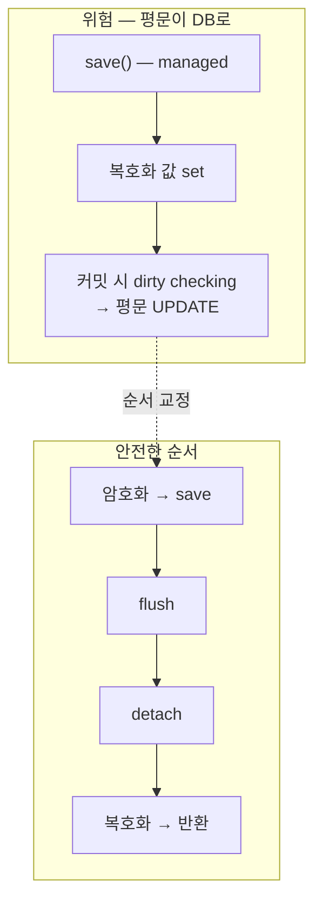
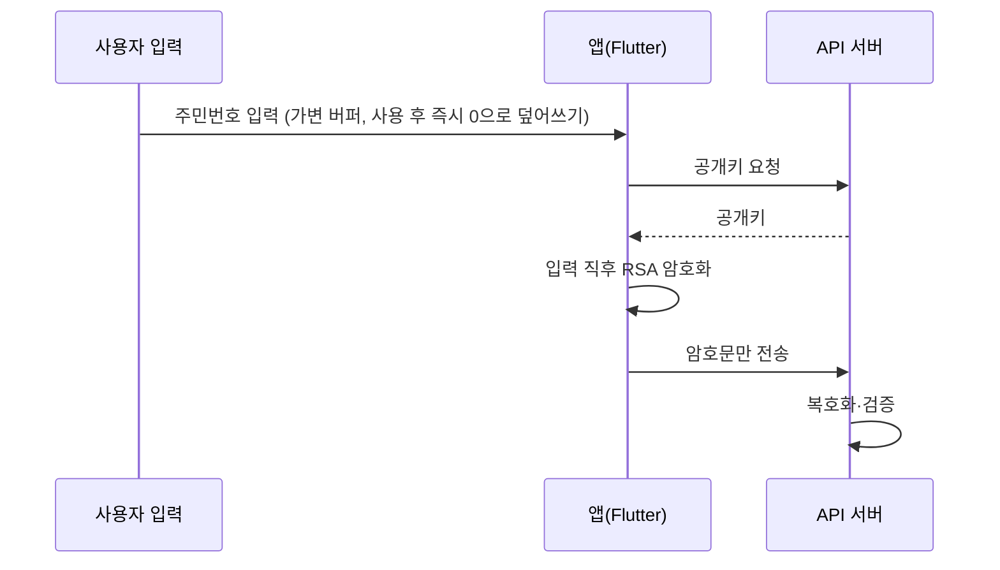
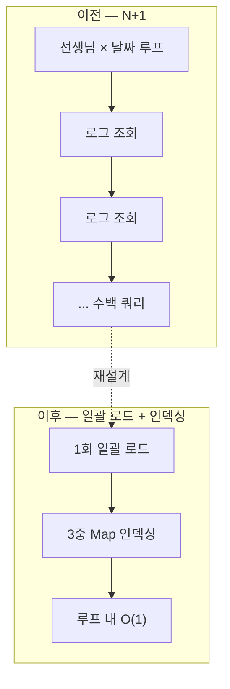
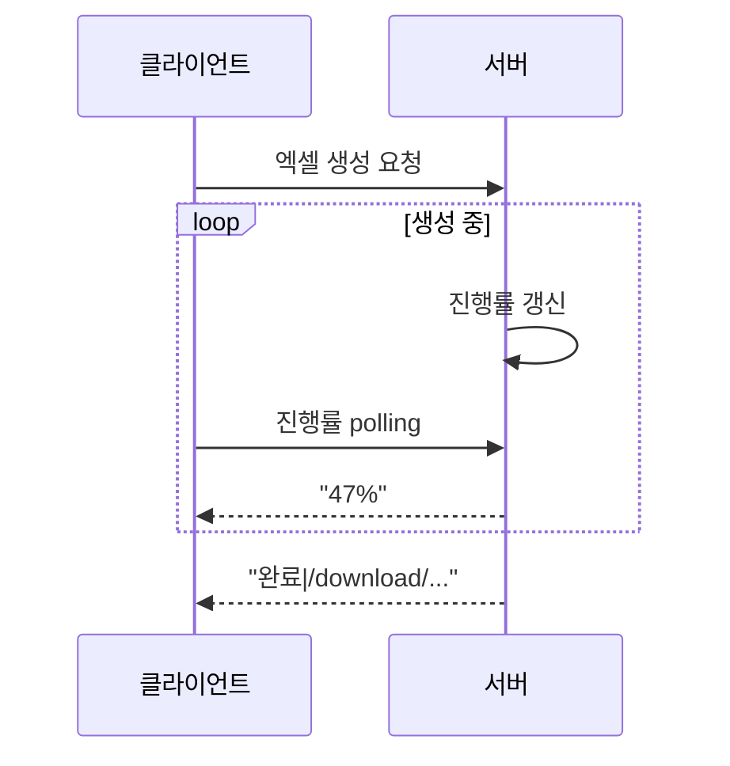

# 모이소 — 경상북도 모바일 도민증

> 약 20만 명이 쓰는 경상북도 복지 통합 플랫폼입니다. 초기엔 팀이 구축했고, 이를 이어받아 약 1년간 Flutter 앱·API 서버·관리자 웹 세 레포의 고도화·버그 수정·운영을 단독으로 맡았습니다.

## 한눈에

| 항목 | 내용 |
|---|---|
| 기간 | 2024.03 ~ 2025.08 |
| 역할 | 초기 팀 구축 → 이후 단독 고도화·운영 (약 1년) |
| 스택 | Java 11, Spring Boot 2.6, JPA · Flutter/Dart · MySQL · GitLab |
| 커밋 | 503 (본인 기준, 3개 레포 합산) |
| 규모 | 약 20만 사용자 · 복지 서비스 8종 이상 |

경상북도청 발주 복지 통합 플랫폼입니다. 팀이 구축한 시스템을 이어받아 앱·API·관리자 웹 세 레포를 모두 맡았고, 개인정보 암호화·인증/인가·조회 성능·외부 데이터 검증·앱 클라이언트·도메인 정합성까지 다뤘습니다. 아래는 **대표 작업 5개**이고, 나머지는 영역별로 접어 뒀습니다.

---

## 대표 작업

### JPA dirty checking으로 인한 복호화 값 재저장 차단 (detach/flush 순서)

조회 시 DB에서 꺼낸 값을 복호화해 반환하는 구조에서, 운영 중 두 버그가 났습니다. 아무 UPDATE도 없는데 평문이 DB에 덮어써지는 것, 그리고 이미 복호화된 값을 한 번 더 복호화해 터지는 것.

원인은 같았습니다. `save()`가 돌려준 엔티티는 영속성 컨텍스트가 관리하는 managed 상태라, 거기에 복호화 값을 `set`하면 커밋 시점에 dirty checking이 평문을 write-back합니다. **"복호화는 읽기"라는 전제가 틀렸습니다.** 정답은 순서였습니다 — `암호화 → save → flush → detach → 복호화 → 반환`. detach를 save 직후로 당기고, 다음 날 flush·`@Transactional`을 보강했습니다. 근본적으론 엔티티 대신 DTO로 반환했어야 합니다.

### 첨부파일 Base64→AES 점진 전환 (매직패킷 포맷 판별)

운영 중 수천 건이 쌓인 상태에서 Base64 → `AES/CBC`로 전환해야 했습니다. 일괄 마이그레이션 대신, 파일 맨 앞 4바이트 매직패킷(`0xDEADBEEF`)으로 AES/Base64를 판별해 **공존 기간에 두 포맷을 모두 처리**하는 점진 전환을 설계했습니다 — 그 4바이트만 읽으면 끝나 별도 DB 컬럼이 필요 없었습니다. 본문은 `CipherOutputStream` + 8KB 버퍼로 스트리밍(엑셀 OOM 경험에서 배운 패턴)하고, IV는 파일마다 랜덤으로 뒀습니다.

### 주민번호 평문 메모리 잔존 제거 (가변 버퍼 + 즉시 RSA)

외부 보안 진단(안랩)에서 나온 여러 항목 중 가장 까다로운 건 회원가입 시 주민번호 평문이 메모리에 잔존하는 이슈였습니다. Frida(fridump3)로 덤프하니 평문이 그대로 나왔습니다 — 원인은 Dart `String`의 immutable 특성(변수를 null로 밀어도 GC 전까지 힙에 잔존)이었습니다. **"변수를 지우면 된다"로는 안 풀렸습니다.**

입력 단계부터 다시 설계했습니다. `String` 대신 가변 버퍼(`List<int>`)로 받아 사용 직후 `fillRange(0,len,0)`로 0으로 덮어쓰고, 입력 즉시 RSA 암호화해 암호문만 전송·검증하도록 흐름을 바꿨습니다(공개키는 매 암호화 직전 서버에서 수신). 이행 재진단에서 통과를 확인했습니다.

### 근무상황표 조회 N+1 제거 (일괄 로드 + 3중 Map 인덱싱)

근무상황표 조회가 한 달 범위에서 10초를 넘겼습니다. 원인은 느린 쿼리가 아니라 인원·날짜에 비례해 **쿼리 수 자체가 폭발하는 N+1**이었습니다. "인덱스로 개별 쿼리를 빠르게"라는 흔한 선택을 버리고, 문제를 **"조회 횟수를 줄인다"로 다시 정의**했습니다. 전체 로그를 한 번에 로드해 `Map<teacherIdx, Map<날짜, Map<type, Log>>>`로 인덱싱(루프 내 O(1)) + (날짜, teacher) 키 2단계 페이징으로 풀었습니다. **10초+ → 0.5초 이내.**

### 전체 엔드포인트 역할 기반 인가 일괄 적용

로그인 여부(`isLogin`)만 보고 통과시키는 엔드포인트가 많았습니다. 로그인했다고 모든 데이터에 접근할 수 있어야 하는 건 아닌데 인가(authorization)가 빠져 있었습니다. 전체 REST 엔드포인트에 `sessionUser.isLoginRole(url)` 역할 검사를 일괄 추가했습니다. URL 문자열 기반이라 경로 변경에 약한 한계는 압니다(지금이라면 `@PreAuthorize`). **인가는 기능 설계와 함께 가야지 나중에 전수로 붙이면 누락이 생긴다**는 걸 체감했습니다.

---

## 그 외 작업 (영역별 · 펼쳐 보기)

<b>개인정보 보안·암호화 — 그 외 3건</b> (RSA 키 싱글톤 · 앱 로컬 DB 암호화 · 개인정보 최소 전송)

### RSA 키 생성 @PostConstruct 싱글톤화

주민번호 RSA 암호화 초기 구현이 요청마다 키쌍을 생성했습니다(무거운 연산). `@PostConstruct`로 서버 기동 시 1회만 생성하는 싱글톤(`RsaKeyProvider`)으로 바꾸고, 앱은 `/user/get/pubkey`로 공개키를 받아갑니다. 트레이드오프는 인지했습니다 — 재시작 시 키가 바뀌어 캐싱한 앱·롤링 배포 요청이 복호화에 실패할 수 있습니다. 정석은 `kid`로 키 교체를 감지하게 하는 방식입니다.

### 로컬 SQLite AES-256 암호화 (기기별 키 관리)

앱이 민감정보를 로컬 SQLite에 캐싱해 기기 분실·루팅 시 노출될 수 있었습니다. `SQLCipher`(AES-256)로 DB를 암호화하되 핵심은 **키 관리**였습니다 — 공통 키는 바이너리에서 추출될 수 있어, 기기별 랜덤 키를 OS 보안 저장소(iOS Keychain / Android EncryptedSharedPreferences)에 보관했습니다. 기존 평문 DB는 첫 실행에 암호화 DB로 옮기는 마이그레이션을 넣었습니다. "암호화했다"가 아니라 "키를 어떻게 지키느냐"가 본질입니다.

### 개인정보 최소 전송 (encRrn만, 로그 평문 제거)

요청마다 평문 주민번호를 실으면 네트워크·서버 로그에 개인정보가 잔류합니다. 요청 body에서 평문 `rrn`을 빼고 `encRrn`만 전송하고, 평문이 필요한 곳은 `getRrn()` API로 분리했습니다. 디버그 로그에 주민번호가 찍히던 흔적(`@Slf4j`, `log.info(rrn)`)도 걷어냈습니다.

<b>인증·인가·보안 감리 — 그 외 3건</b> (첨부 선언적 RBAC · 로그인 비밀번호 RSA · 연간 보안 진단)

### 첨부파일 접근 제어 (target→role 선언적 매핑)

첨부파일은 도메인마다 접근 규칙이 달랐습니다. `Attach.target` → 허용 역할 매핑을 `static final` 불변 맵으로 선언해 권한 검사를 한 곳에서 처리했습니다. 엑셀 파일은 생성한 관리자(adminIdx) 또는 도청 ADMIN만 보도록 세분화했습니다. 표준 `@PreAuthorize` 대신 이 방식을 쓴 건 역할이 아니라 **도메인 데이터 기반 접근**이었기 때문입니다.

### 로그인 비밀번호 RSA (Security 필터 전처리)

평문 비밀번호 전송 금지 요건을, 로그인 로직을 재설계하지 않고 충족했습니다. `@PostConstruct` 공개키를 프론트가 `JSEncrypt`로 암호화해 보내면, `PasswordPreprocessingFilter`(`OncePerRequestFilter`)가 인증 필터 **앞에서** 복호화한 뒤 `HttpServletRequestWrapper`로 요청을 교체해 기존 BCrypt 흐름에 그대로 연결했습니다.

### 연간 시큐어코딩 진단 조치 (예외 세분화·XSS·로깅)

매년 진단에 대응해 운영 서비스에 보안 조치를 반영했습니다. XSS 입력 필터, `catch(Exception)` 예외 세분화, `printStackTrace()` → 로거 전환, 모든 I/O를 try-with-resources로, **권한 검증 없이 `userIdx`만으로 동작하던 알림 엔드포인트 삭제**까지. 변경 범위를 좁히고 사이드 이펙트를 먼저 보는 습관이 이때 굳었습니다.

<b>성능·확장성 — 그 외 2건</b> (쿼리 인덱스 최적화 · 대량 엑셀 SXSSF 스트리밍)

### 집계 쿼리 인덱스 최적화 (컬럼 함수 제거)

대시보드·농어민수당 집계가 느렸습니다. 원인은 `date_format(create_date,…)`나 `LIKE '%2025%'`처럼 **컬럼에 함수를 씌워** 인덱스를 못 타는 쿼리였습니다. `create_year = :year` 동등 비교로 바꾸고 불필요한 `LIKE`를 걷어냈습니다. 무거운 차트 집계는 기본 숨김으로 지연 실행했습니다. "컬럼에 함수를 적용하면 인덱스가 죽는다"는 원칙을 쿼리마다 확인하게 됐습니다.

### 대량 엑셀 — SXSSF 스트리밍 + 비동기 + 진행률 polling

수천 건 엑셀을 통째로 메모리에 쌓다가 OOM이 났습니다. `SXSSFWorkbook`(행을 디스크로 흘리는 스트리밍 워크북)으로 메모리를 잡고, 생성을 백그라운드로 돌려 진행률을 `HashMap`에 저장 → 클라이언트 polling, 완료 시 `"완료|{downloadUrl}"`로 자동 다운로드되게 했습니다.

단, `HashMap`은 단일 서버에서만 동작합니다 — 다중 인스턴스면 Redis로 옮겨야 합니다(아래 '아쉬운 것').

<b>외부 데이터·검증 — 4건</b> (거주이력 · GPS 권한 · QR qrcodeIdx · 식별자 선택)

공공기관 데이터와 디바이스 환경은 입력 품질을 보장하지 못합니다 — 이 갈래의 공통 교훈입니다.

### 농어민수당 거주이력 검증 (1년 이력 전체 기준)

기존 로직은 "마지막 전입일부터 1년 이상이면 통과"라, 경북에 살다 떠났다 돌아온 사람도 통과됐습니다. 마이데이터 XML 주소이력을 역순으로 훑어 **최근 1년 내 경북이 아닌 주소가 한 번이라도 나오면 즉시 탈락**시키도록 판정 기준을 "현재 주소"에서 "1년치 이력 전체"로 옮겼습니다. 행정 XML은 태그 누락·빈 값이 잦아 모든 파싱 지점의 방어가 필수였습니다.

### 현장 GPS 검증 (위치 권한 정밀도별 분기)

현장 QR을 GPS 허용 범위 안에서 인식해야 인정되는데, 정확도가 위치 권한(정밀/대략)에 따라 크게 달랐고 iOS는 `unableToDetermine`을 추가로 반환했습니다. 권한 분기를 "허용 값만 통과시키는 긍정 필터링"(`whileInUse || always`)으로 짜 플랫폼 차이에 덜 취약하게 했고, 실측으로 허용 반경을 정했습니다. 재촬영 우회를 막으려 앱 내 카메라 실시간 인식만 인정했습니다. 모든 부정을 막기보다 적정 검증 수준을 협의로 정했습니다.

### QR 경로당 식별 (위경도 → qrcodeIdx 키)

동일 위경도로 등록된 경로당이 있어 엉뚱한 곳이 잡혔습니다. QR 데이터에 `qrcodeIdx`(고유 식별자)를 넣어 기본 조회 키로 삼고 위경도는 보조로 남겼습니다. QR 재발급 없이 서버에서 매핑을 관리할 수 있는 이점도 따라왔습니다.

### 사용자 식별자 userIdx → userRrn 전환

앱 재설치·기기 변경 시 `userIdx`가 달라져 이력 조회가 어긋났습니다. 본인인증 시점부터 존재하는 (암호화된) 주민번호 기준으로 바꿨습니다. **식별자는 도메인 설계 초기에 정해야** 합니다 — 중간에 바꾸면 쿼리가 두 벌이 되고 이관 문제가 따릅니다.

<b>Flutter 클라이언트 — 4건</b> (JWT 선제 재발급 · 보상 트랜잭션 · 전역객체 null · 외국인 체크섬)

### JWT 만료 선제 감지·자동 재발급 (NavigatorObserver)

토큰 만료를 모르고 호출하면 401로 화면이 깨졌습니다. `NavigatorObserver`를 전역 등록해 화면 전환마다 `dart_jsonwebtoken`으로 `exp`만 디코드(네트워크 왕복 없이 판단)하고, 임박하면 자동 재발급했습니다(`isRefreshingToken` 중복 방지, `retryCount` 상한). 재발급 직후 `didPush`에서 곧바로 `pushReplacementNamed`를 부르면 transition 충돌이 나서, `Future.microtask`로 감싸 해결했습니다. 횡단 관심사는 공통 진입점 하나로 모으는 게 낫습니다.

### 이미지 업로드 실패 보상 트랜잭션 (1단계 롤백)

"결과 레코드 생성 → 이미지 업로드" 2단계에서 2단계 실패 시 빈 레코드가 남았습니다. 서버 `/APP/happy/result/fail`로 1단계를 삭제하는 **보상 트랜잭션**으로 정합성을 맞췄습니다. 차선책임은 압니다 — 멀티파트 단일 요청이나 서버 트랜잭션이 더 낫습니다.

### 화면 전환 후 전역 상태 유실 (SharedPreferences 단일 출처)

화면 전환 후 전역 객체(`GV.userData.user`)가 재초기화되며 `userIdx` 등이 null이 됐습니다. 휘발 가능한 전역 객체 대신 `SharedPreferences`(영속 로컬)를 **단일 출처**로 삼아 읽도록 바꿨습니다. 인메모리 상태는 "항상 살아있다"고 가정하면 안 됩니다.

### 외국인 등록번호 체크섬 분기

단일 알고리즘으로 검사하면 외국인 등록번호가 조용히 통과/탈락합니다. 성별코드(1·2 내국인 / 5·6 외국인)로 갈라 체크섬을 분리했습니다. 같은 형식이라도 출처별 규격이 다르면 분기를 명시해야 silent failure가 안 납니다.

<b>도메인 정합성 · 설계 판단 — 5건</b> (CI 덮어쓰기 · 탈퇴 처리 · 거주지 스냅샷 · 매직패킷 선택 · DB 레벨 권한)

### CI null 덮어쓰기 수정 (요청 객체 vs DB 객체)

홈 진입 시 CI를 생성·저장하는데 코드가 요청 body 객체(`user`)를 참조했습니다. 클라이언트는 CI를 안 보내니 `user.getCi()`는 항상 null이고, 그게 DB에서 읽은 `dbUser`의 CI를 덮어써 **홈마다 CI가 지워지고 마이데이터 연동이 연쇄 실패**했습니다. 참조를 `dbUser`로 바로잡아 해결했습니다. 요청 객체와 DB 객체는 이름부터 분리해야 합니다.

### 탈퇴 교사 이력 보존 (Null Object)

탈퇴 시 조인이 끊겨 근무 이력에서 이름이 사라졌습니다. null인 선생님을 빈 객체(Null Object)로 받아 `(탈퇴)`를 붙이고, 로그 처리는 탈퇴와 무관하게 실행되게 했습니다. 이력은 원본이 사라져도 당시 상태를 보존해야 합니다(idx=0 약속은 빚이라, `status` 컬럼이 옳습니다).

### 신청 시점 거주지 스냅샷

임업인 신청 시 거주지를 `ForestApply`에 스냅샷으로 저장했습니다. 주소가 나중에 바뀌어도 신청 당시 정보가 보존됩니다. 이력성 데이터는 참조가 아니라 스냅샷으로 남겨야 합니다.

### (설계) 암호화 판별 — DB 컬럼 대신 파일 매직패킷

운영 파일이 이미 수천 건이라, DB `is_encrypted` 컬럼은 일괄 마이그레이션·상태 불일치 위험이 있었습니다. 파일 헤더 4바이트 매직패킷은 스키마 변경 없이 파일만 보면 상태를 알 수 있고 **불일치 자체가 생기지 않습니다**.

### (설계) 시군 단위 권한 — DB 레벨 area_code 필터

시군 단위 접근 제한이 필요했습니다. 앱 레이어 필터링은 전체를 가져온 뒤 거르는 구조라 비효율적이라, `area_code`를 세 테이블에 추가해 **쿼리 조건 자체에 권한 필터를 포함**시켰습니다(데이터 노출도 DB 레벨에서 차단).

---

## 잘 됐던 것

**이어받은 뒤 단독으로 운영한 밀도.** 인수 후에는 고도화·버그 수정·배포·감리 대응·유지보수를 혼자 도맡았습니다. 코드 전반에 맥락이 있어 장애가 나면 원인부터 수정까지 직접 추적할 수 있었습니다.

**운영 중 서비스에 보안 조치를 반영하는 법을 익혔습니다.** 연간 진단 조치를 라이브 서비스에 단계적으로 적용하며, 변경 범위 최소화·사이드 이펙트 선분석이 핵심이라는 걸 체득했습니다.

**행복선생님·통합돌봄을 처음부터 끝까지 만들었습니다.** 요구사항 정리·화면 기획서부터 직접 — "왜 이 기능이 필요한지"를 먼저 이해하고 설계했습니다.

---

## 아쉬운 것 · 다음엔 다르게

**인가를 초기 설계에 넣지 못했습니다.** 인증은 있었지만 인가가 빠진 채 굴러가다 뒤늦게 일괄 적용했습니다. 접근 제어는 기능 설계와 함께 가야 누락이 없습니다.

**엑셀 진행률을 처음부터 Redis로 했어야 했습니다.** `HashMap`은 단일 서버에서만 동작합니다.

**엑셀 OOM을 겪고 나서야 스트리밍을 배웠습니다.** 대량 데이터를 메모리에 통째로 올리면 터진다는 걸 그때 체감했습니다 — 순서가 반대였습니다.

**공공 데이터 품질을 너무 낙관했습니다.** XML 파싱 초반 null 체크 누락으로 NPE가 났습니다. 외부 데이터는 늘 방어적으로 다뤄야 합니다.

**Spring Boot 2.6에 오래 머물렀습니다.** 안정성을 우선해 업그레이드를 미뤘지만, 이어받은 직후가 비용이 가장 쌌던 시점이었습니다.
