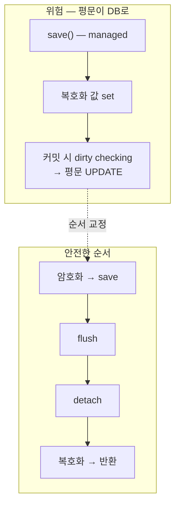
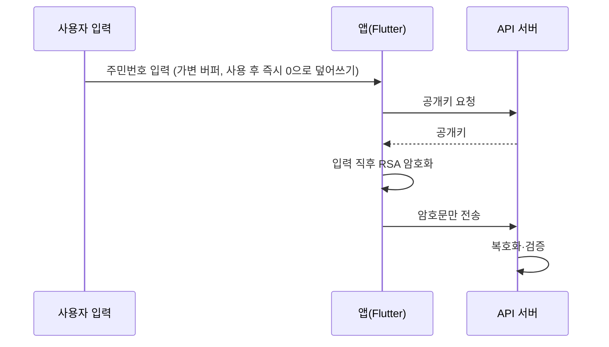
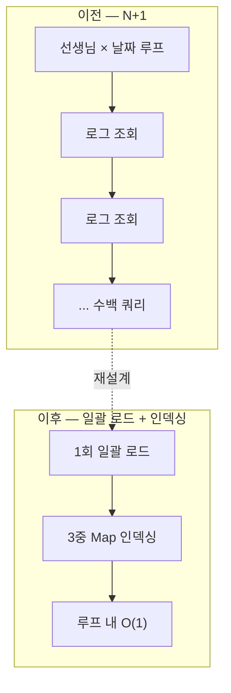
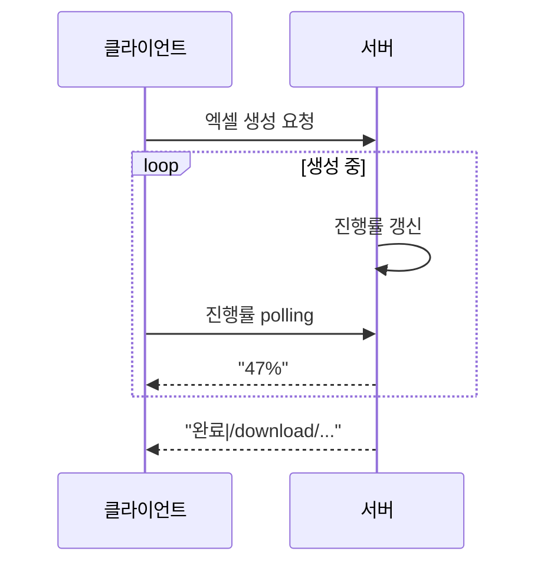

# 모이소 — 경상북도 모바일 도민증

> 약 20만 명이 쓰는 경상북도 복지 통합 플랫폼입니다. 초기엔 팀이 구축했고, 이를 이어받아 약 1년간 Flutter 앱·API 서버·관리자 웹 세 레포의 고도화·버그 수정·운영을 단독으로 맡았습니다.

## 한눈에

| 항목 | 내용 |
|---|---|
| 기간 | 2024.03 ~ 2025.08 |
| 역할 | 초기 팀 구축 → 이후 단독 고도화·운영 (약 1년) |
| 스택 | Java 11, Spring Boot 2.6, JPA · Flutter/Dart · MySQL · GitLab |
| 커밋 | 503 (본인 기준, 3개 레포 합산) |
| 규모 | 약 20만 사용자 · 복지 서비스 8종 이상 |

경상북도청 발주 복지 통합 플랫폼입니다. 팀이 구축한 시스템을 이어받아 앱·API·관리자 웹 세 레포를 모두 맡았고, 개인정보 암호화·인증/인가·조회 성능·외부 데이터 검증·앱 클라이언트·도메인 정합성까지 다뤘습니다. 아래는 **대표 작업 5개**이고, 나머지는 영역별로 접어 뒀습니다.

---

## 대표 작업

### JPA dirty checking으로 인한 복호화 값 재저장 차단 (detach/flush 순서)

조회 과정에서 DB 값을 복호화해서 반환하는 로직을 구현하면서 운영 중 두 가지 문제가 발생했습니다. 별도의 UPDATE가 없었는데 암호화 컬럼에 평문이 저장되는 문제와, 이미 복호화된 값을 다시 복호화하면서 예외가 발생하는 문제가 있었습니다.

원인은 JPA 엔티티의 영속 상태를 제대로 고려하지 않은 것이었습니다. save() 이후 엔티티는 영속성 컨텍스트에서 관리되고 있었고, 복호화한 값을 엔티티에 set하면서 변경 감지가 발생했습니다. 트랜잭션 커밋 시점에 dirty checking으로 변경된 값이 UPDATE되어 평문이 DB에 저장됐습니다.

당시에는 save() → flush() → detach() → 복호화 순서로 변경하고, 트랜잭션 범위도 다시 정리했습니다. 특히 detach() 전에 엔티티 값을 변경하면 안 된다는 점을 기준으로 수정했습니다.

지금 다시 설계한다면 엔티티 자체를 반환하지 않고 DTO로 변환하는 과정에서 복호화하겠습니다. 영속 상태의 엔티티를 조회용 데이터로 직접 가공하는 것 자체가 문제의 원인이었기 때문입니다.

```mermaid
flowchart TB
  subgraph wrong ["위험 — 평문이 DB로"]
    W1["save() — managed"] --> W2["복호화 값 set"] --> W3["커밋 시 dirty checking<br/>→ 평문 UPDATE"]
  end
  subgraph right ["안전한 순서"]
    R1["암호화 → save"] --> R2["flush"] --> R3["detach"] --> R4["복호화 → 반환"]
  end
  W3 -. 순서 교정 .-> R1
```

### 첨부파일 Base64→AES 점진 전환 (매직패킷 포맷 판별)

운영 중인 상태에서 수천 건의 파일을 Base64 방식에서 AES/CBC 방식으로 전환해야 했습니다. 이미 저장된 파일이 많아서 전체 파일을 한 번에 변환하는 방식은 운영 부담이 컸습니다.

그래서 기존 파일과 신규 파일을 일정 기간 함께 처리할 수 있도록 포맷을 구분하는 방식을 적용했습니다. 파일 앞부분에 4바이트 매직 값을 두고, 해당 값이 있으면 AES 파일로 판단하고 없으면 기존 Base64 파일로 처리했습니다. 파일 앞부분만 확인하면 포맷을 구분할 수 있어서 별도의 DB 컬럼을 추가하지 않아도 됐습니다.

암호화 과정은 CipherOutputStream과 8KB 버퍼를 사용해 스트리밍으로 처리했습니다. 이전에 엑셀 처리에서 대용량 데이터를 한 번에 메모리에 올렸다가 OOM이 발생했던 경험이 있어서, 파일 암호화에서도 전체 데이터를 메모리에 적재하지 않는 방식으로 구현했습니다.

IV는 파일마다 랜덤으로 생성해 사용했습니다. 결과적으로 기존 파일을 일괄 변환하지 않고도 기존 포맷과 신규 포맷을 함께 처리하면서 점진적으로 전환할 수 있었습니다.

```mermaid
flowchart LR
  M["매직패킷 4B<br/>0xDEADBEEF"] --> IV["랜덤 IV 16B"] --> C["AES/CBC 암호문"]
```

### 주민번호 평문 메모리 잔존 제거 (가변 버퍼 + 즉시 RSA)

외부 보안 진단에서 회원가입 과정의 주민번호가 메모리에 평문으로 남아 있는 문제가 발견됐습니다. Frida와 fridump3로 메모리를 덤프해보니 입력한 주민번호가 그대로 확인됐습니다.

처음에는 사용이 끝난 뒤 변수를 null로 변경하면 해결될 것으로 생각했습니다. 하지만 Dart의 String은 immutable이라 기존 문자열 데이터를 직접 덮어쓸 수 없었고, 변수를 제거하더라도 해당 메모리가 GC 전까지 남아 있을 수 있었습니다. 단순히 변수를 삭제하는 방식으로는 해결할 수 없는 문제였습니다.

입력 방식부터 변경했습니다. 주민번호를 String으로 유지하지 않고 List<int> 형태의 가변 버퍼로 받아 처리하고, 사용이 끝난 즉시 fillRange(0, len, 0)으로 버퍼를 0으로 덮어썼습니다. 또한 입력 직후 RSA로 암호화하고 이후에는 암호문만 서버로 전송하도록 흐름을 변경했습니다. 공개키도 매 암호화 직전에 서버에서 받아 사용했습니다.

수정 후 동일한 방식으로 메모리 덤프를 진행했고, 재진단에서 해당 항목이 조치된 것을 확인했습니다.

```mermaid
sequenceDiagram
  participant U as 사용자 입력
  participant A as 앱(Flutter)
  participant S as API 서버
  U->>A: 주민번호 입력 (가변 버퍼, 사용 후 즉시 0으로 덮어쓰기)
  A->>S: 공개키 요청
  S-->>A: 공개키
  A->>A: 입력 직후 RSA 암호화
  A->>S: 암호문만 전송
  S->>S: 복호화·검증
```

### 근무상황표 조회 N+1 제거 (일괄 로드 + 3중 Map 인덱싱)

근무상황표를 한 달 범위로 조회할 때 응답 시간이 10초를 넘는 문제가 있었습니다. 처음에는 쿼리 자체가 느린 문제라고 생각했지만, 확인해보니 쿼리 하나의 실행 시간이 아니라 인원과 날짜가 늘어날수록 조회 쿼리가 반복해서 실행되는 N+1 문제가 원인이었습니다.

기존처럼 각각의 쿼리에 인덱스를 추가해서 실행 시간을 줄이는 대신, 문제를 쿼리 실행 횟수 자체를 줄이는 방향으로 잡았습니다.

전체 근무 로그를 한 번에 조회한 뒤 Map<teacherIdx, Map<날짜, Map<type, Log>>> 구조로 메모리에 인덱싱했습니다. 이후 필요한 로그는 반복문에서 Map을 조회해 바로 가져오도록 변경해 불필요한 DB 조회를 없앴습니다.

조회 데이터가 많아지는 문제는 날짜와 교사를 기준으로 2단계 페이징을 적용했습니다. 그 결과 기존 10초 이상 걸리던 조회를 0.5초 이내로 줄였습니다.

```mermaid
flowchart TB
  subgraph before ["이전 — N+1"]
    L1["선생님 × 날짜 루프"] --> Q1["로그 조회"] --> Q2["로그 조회"] --> Q3["... 수백 쿼리"]
  end
  subgraph after ["이후 — 일괄 로드 + 인덱싱"]
    B1["1회 일괄 로드"] --> B2["3중 Map 인덱싱"] --> B3["루프 내 O(1)"]
  end
  Q3 -. 재설계 .-> B1
```

### 전체 엔드포인트 역할 기반 인가 일괄 적용

로그인 여부인 isLogin만 확인하고 요청을 처리하는 REST 엔드포인트가 많았습니다. 로그인한 사용자라고 해서 모든 기능에 접근할 수 있는 것은 아닌데, 역할에 따른 인가 처리가 빠져 있었습니다.

문제를 확인한 뒤 전체 REST 엔드포인트에 sessionUser.isLoginRole(url)을 적용해 사용자 역할에 따라 접근 권한을 검사하도록 수정했습니다.

다만 URL 문자열을 기준으로 권한을 판단하는 방식이라 URL이 변경되면 권한 로직도 함께 수정해야 하는 한계가 있었습니다. 지금 다시 설계한다면 @PreAuthorize를 사용해 메서드 단위로 권한을 관리했을 것 같습니다.

이 경험을 통해 인가는 인증이 끝난 뒤 별도로 붙이는 작업이 아니라, 기능을 설계할 때부터 접근 권한까지 같이 정의해야 한다는 점을 배웠습니다.

---

## 그 외 작업 (영역별 · 펼쳐 보기)

<b>개인정보 보안·암호화 — 그 외 3건</b> (RSA 키 싱글톤 · 앱 로컬 DB 암호화 · 개인정보 최소 전송)

### RSA 키 생성 @PostConstruct 싱글톤화

주민번호 RSA 암호화 초기 구현에서 요청이 들어올 때마다 키쌍을 생성하고 있었습니다. RSA 키 생성은 비용이 큰 작업이라 요청마다 수행할 필요가 없다고 판단했고, @PostConstruct에서 서버 시작 시 한 번만 생성하도록 RsaKeyProvider를 만들었습니다. 앱에서는 /user/get/pubkey를 호출해 공개키를 받아 암호화하도록 했습니다.

다만 서버가 재시작되면 키가 새로 생성되기 때문에 기존 공개키를 가지고 있던 요청이 복호화되지 않을 수 있습니다. 지금 다시 설계한다면 kid를 사용해 키 버전을 구분하고, 키를 교체하는 방식까지 고려했을 것 같습니다.

### 로컬 SQLite AES-256 암호화 (기기별 키 관리)

앱에서 민감정보를 SQLite에 저장하고 있어 기기 분실이나 루팅 시 데이터가 노출될 가능성이 있었습니다. SQLCipher를 적용해 SQLite 데이터베이스 자체를 AES-256으로 암호화했습니다.

여기서 가장 신경 쓴 부분은 암호화 키였습니다. 모든 기기에서 같은 키를 사용하면 앱에서 키가 유출됐을 때 모든 기기의 데이터베이스를 복호화할 수 있기 때문에, 기기마다 별도의 랜덤 키를 생성했습니다. 키는 iOS Keychain과 Android EncryptedSharedPreferences에 저장했습니다.

기존에 저장되어 있던 평문 데이터베이스는 앱 최초 실행 시 암호화된 데이터베이스로 옮기도록 마이그레이션했습니다.

### 개인정보 최소 전송 (encRrn만, 로그 평문 제거)

API 요청에 평문 주민번호가 포함되는 구간이 있었습니다. 평문이 네트워크나 서버 로그에 남을 가능성을 줄이기 위해 일반 요청에서는 rrn 대신 encRrn만 전달하도록 변경했습니다.

평문 주민번호가 실제로 필요한 기능은 getRrn()으로 분리했고, 디버그 과정에서 주민번호가 로그에 출력되던 코드도 함께 제거했습니다.

<b>인증·인가·보안 감리 — 그 외 3건</b> (첨부 선언적 RBAC · 로그인 비밀번호 RSA · 연간 보안 진단)

### 첨부파일 접근 제어 (target→role 선언적 매핑)

첨부파일은 기능마다 접근할 수 있는 역할이 달랐습니다. 그래서 Attach.target을 기준으로 접근 가능한 역할을 static final 맵으로 정의하고, 첨부파일 조회 시 공통으로 권한을 확인하도록 했습니다.

엑셀 파일은 일반 첨부파일과 달리 생성한 관리자(adminIdx) 또는 도청 ADMIN만 접근할 수 있도록 별도로 검사했습니다.

단순히 역할만 확인하는 것이 아니라 첨부파일의 대상과 현재 사용자의 관계까지 확인해야 하는 구조였기 때문에 @PreAuthorize만으로 처리하기보다는 도메인 데이터를 기준으로 권한을 검사하도록 구현했습니다.

### 로그인 비밀번호 RSA (Security 필터 전처리)

로그인 비밀번호를 평문으로 전송하지 않도록 RSA 암호화를 적용했습니다. 프론트에서 서버의 공개키를 받아 JSEncrypt로 비밀번호를 암호화하고, 서버에서는 PasswordPreprocessingFilter에서 복호화하도록 했습니다.

기존 로그인 로직과 BCrypt 처리는 그대로 유지하기 위해 인증 필터 앞에서 요청을 가로채 비밀번호를 복호화한 뒤 HttpServletRequestWrapper로 요청을 교체했습니다. 기존 인증 로직을 크게 수정하지 않고 보안 요구사항을 적용한 방식입니다.

### 연간 시큐어코딩 진단 조치 (예외 세분화·XSS·로깅)

매년 진행되는 보안 진단에서 발견된 항목들을 운영 서비스에 반영했습니다.

XSS 입력 필터를 추가하고, catch(Exception)으로 뭉뚱그려 처리하던 예외를 구체적인 예외로 나눴습니다. printStackTrace()는 로거로 변경하고, I/O 처리는 try-with-resources를 사용하도록 수정했습니다.

또한 권한 확인 없이 userIdx만 전달받아 동작하던 알림 API도 삭제했습니다.

운영 중인 서비스라 한 번에 많은 부분을 변경하기보다는 문제가 된 범위만 수정하고 기존 기능에 영향이 없는지 확인하면서 적용했습니다.

<b>성능·확장성 — 그 외 2건</b> (쿼리 인덱스 최적화 · 대량 엑셀 SXSSF 스트리밍)

### 집계 쿼리 인덱스 최적화 (컬럼 함수 제거)

대시보드와 농어민수당 집계 쿼리의 실행 시간이 길었습니다. 확인해보니 date_format(create_date, ...)처럼 컬럼에 함수를 적용하거나 LIKE '%2025%' 형태로 검색하면서 인덱스를 제대로 활용하지 못하고 있었습니다.

연도 조건을 별도 컬럼인 create_year = :year로 변경하고 불필요한 LIKE 조건을 제거했습니다. 조회 빈도가 낮고 무거운 차트는 처음부터 조회하지 않고 사용자가 선택했을 때 조회하도록 변경했습니다.

### 대량 엑셀 — SXSSF 스트리밍 + 비동기 + 진행률 polling

대시보드와 농어민수당 집계 쿼리의 실행 시간이 길었습니다. 확인해보니 date_format(create_date, ...)처럼 컬럼에 함수를 적용하거나 LIKE '%2025%' 형태로 검색하면서 인덱스를 제대로 활용하지 못하고 있었습니다.

연도 조건을 별도 컬럼인 create_year = :year로 변경하고 불필요한 LIKE 조건을 제거했습니다. 조회 빈도가 낮고 무거운 차트는 처음부터 조회하지 않고 사용자가 선택했을 때 조회하도록 변경했습니다.

```mermaid
sequenceDiagram
  participant C as 클라이언트
  participant S as 서버
  C->>S: 엑셀 생성 요청
  loop 생성 중
    S->>S: 진행률 갱신
    C->>S: 진행률 polling
    S-->>C: "47%"
  end
  S-->>C: "완료|/download/..."
```

단, `HashMap`은 단일 서버에서만 동작합니다 — 다중 인스턴스면 Redis로 옮겨야 합니다(아래 '아쉬운 것').

<b>외부 데이터·검증 — 4건</b> (거주이력 · GPS 권한 · QR qrcodeIdx · 식별자 선택)

공공 데이터와 디바이스에서 들어오는 값은 항상 정상적인 형태라고 가정하면 안 됐습니다.

### 농어민수당 거주이력 검증 (1년 이력 전체 기준)

기존에는 마지막 전입일부터 1년 이상 경북에 거주했는지만 확인했습니다. 이 방식에서는 경북에 살다가 다른 지역으로 이동한 뒤 다시 돌아온 경우도 조건을 통과하는 문제가 있었습니다.

마이데이터에서 받은 주소 이력을 최근 기록부터 확인해 최근 1년 안에 경북 외 지역의 주소가 한 번이라도 있으면 탈락하도록 기준을 변경했습니다.

또한 행정기관에서 받은 XML 데이터는 태그가 없거나 값이 비어 있는 경우가 있어 파싱 과정에서 null을 전제로 처리하도록 수정했습니다.

### 현장 GPS 검증 (위치 권한 정밀도별 분기)

현장에서 QR을 촬영할 때 실제 위치가 허용 범위 안에 있는지 확인하는 기능을 구현했습니다. 위치 권한에 따라 전달되는 정확도가 달랐고, iOS에서는 unableToDetermine 같은 별도의 상태도 반환됐습니다.

플랫폼별로 허용되는 권한을 명확하게 분기하고 실제 현장에서 위치 정확도를 측정해 허용 반경을 정했습니다.

또한 저장된 사진이나 외부 카메라로 촬영한 이미지를 다시 사용하는 우회를 막기 위해 앱 내부 카메라에서 실시간으로 인식한 QR만 인정하도록 했습니다.

### QR 경로당 식별 (위경도 → qrcodeIdx 키)

현장에서 QR을 촬영할 때 실제 위치가 허용 범위 안에 있는지 확인하는 기능을 구현했습니다. 위치 권한에 따라 전달되는 정확도가 달랐고, iOS에서는 unableToDetermine 같은 별도의 상태도 반환됐습니다.

플랫폼별로 허용되는 권한을 명확하게 분기하고 실제 현장에서 위치 정확도를 측정해 허용 반경을 정했습니다.

또한 저장된 사진이나 외부 카메라로 촬영한 이미지를 다시 사용하는 우회를 막기 위해 앱 내부 카메라에서 실시간으로 인식한 QR만 인정하도록 했습니다.

### 사용자 식별자 userIdx → userRrn 전환

초기에는 userIdx를 기준으로 사용자 이력을 조회했는데, 앱 재설치나 기기 변경 과정에서 사용자 식별자가 달라져 기존 이력과 연결되지 않는 문제가 있었습니다.

본인인증 시점부터 가지고 있는 암호화된 주민번호를 기준으로 사용자를 식별하도록 변경했습니다.

사용자를 무엇으로 식별할지는 기능을 구현한 뒤 바꾸기 어려운 부분이라, 도메인 설계 단계에서 먼저 정해야 한다는 것을 경험했습니다.

<b>Flutter 클라이언트 — 4건</b> (JWT 선제 재발급 · 보상 트랜잭션 · 전역객체 null · 외국인 체크섬)

### JWT 만료 선제 감지·자동 재발급 (NavigatorObserver)

JWT가 만료된 상태에서 API를 호출하면 401이 발생하면서 화면이 정상적으로 동작하지 않는 문제가 있었습니다.

NavigatorObserver를 전역으로 등록해 화면이 전환될 때마다 JWT의 exp를 확인하고, 만료가 임박하면 새로운 토큰을 발급받도록 했습니다. 토큰 재발급 요청이 여러 번 발생하지 않도록 isRefreshingToken으로 중복 요청을 막고 retryCount에도 제한을 뒀습니다.

재발급 직후 pushReplacementNamed를 바로 호출하면 화면 전환 중 충돌이 발생하는 문제가 있어 Future.microtask를 사용해 다음 이벤트 루프에서 실행하도록 수정했습니다.

### 이미지 업로드 실패 보상 트랜잭션 (1단계 롤백)

결과 데이터를 먼저 생성하고 이후 이미지를 업로드하는 2단계 구조에서 이미지 업로드가 실패하면 결과 데이터만 DB에 남는 문제가 있었습니다.

이미지 업로드 실패 시 서버의 /APP/happy/result/fail을 호출해 앞에서 생성한 결과 데이터를 삭제하도록 했습니다.

두 작업을 하나의 트랜잭션으로 처리할 수 없는 구조라 보상 트랜잭션으로 처리했지만, 다시 설계한다면 서버에서 두 작업을 함께 처리하는 방향을 우선 검토할 것 같습니다.

### 화면 전환 후 전역 상태 유실 (SharedPreferences 단일 출처)

화면을 이동한 뒤 전역 객체인 GV.userData.user가 다시 초기화되면서 userIdx 등의 값이 null이 되는 문제가 있었습니다.

전역 객체에 의존하지 않고 SharedPreferences에 저장된 값을 기준으로 사용자 정보를 조회하도록 변경했습니다. 전역 객체는 앱 실행 중 언제든 초기화될 수 있다는 점을 고려하지 못했던 부분입니다.

### 외국인 등록번호 체크섬 분기

내국인과 외국인의 등록번호는 비슷한 형식을 가지고 있지만 체크섬 계산 방식에 차이가 있었습니다.

성별 코드가 1·2인 경우와 5·6인 경우를 구분해 각각 다른 검증 로직을 적용했습니다. 형식이 비슷하더라도 데이터 규격이 다르면 하나의 검증 로직으로 처리하지 않아야 한다는 점을 확인한 사례입니다.

<b>도메인 정합성 · 설계 판단 — 5건</b> (CI 덮어쓰기 · 탈퇴 처리 · 거주지 스냅샷 · 매직패킷 선택 · DB 레벨 권한)

### CI null 덮어쓰기 수정 (요청 객체 vs DB 객체)

내국인과 외국인의 등록번호는 비슷한 형식을 가지고 있지만 체크섬 계산 방식에 차이가 있었습니다.

성별 코드가 1·2인 경우와 5·6인 경우를 구분해 각각 다른 검증 로직을 적용했습니다. 형식이 비슷하더라도 데이터 규격이 다르면 하나의 검증 로직으로 처리하지 않아야 한다는 점을 확인한 사례입니다.

### 탈퇴 교사 이력 보존 (Null Object)

내국인과 외국인의 등록번호는 비슷한 형식을 가지고 있지만 체크섬 계산 방식에 차이가 있었습니다.

성별 코드가 1·2인 경우와 5·6인 경우를 구분해 각각 다른 검증 로직을 적용했습니다. 형식이 비슷하더라도 데이터 규격이 다르면 하나의 검증 로직으로 처리하지 않아야 한다는 점을 확인한 사례입니다.

### 신청 시점 거주지 스냅샷

내국인과 외국인의 등록번호는 비슷한 형식을 가지고 있지만 체크섬 계산 방식에 차이가 있었습니다.

성별 코드가 1·2인 경우와 5·6인 경우를 구분해 각각 다른 검증 로직을 적용했습니다. 형식이 비슷하더라도 데이터 규격이 다르면 하나의 검증 로직으로 처리하지 않아야 한다는 점을 확인한 사례입니다.

### (설계) 암호화 판별 — DB 컬럼 대신 파일 매직패킷

운영 중 이미 수천 개의 파일이 저장된 상태에서 기존 Base64 파일을 AES/CBC 파일로 전환해야 했습니다.

DB에 is_encrypted 컬럼을 추가하면 기존 파일을 일괄 마이그레이션해야 하고, DB 상태와 실제 파일 상태가 달라질 가능성도 있었습니다.

그래서 파일 헤더에 4바이트 매직 값을 넣어 암호화된 파일인지 판별하도록 설계했습니다. 파일 앞부분만 확인하면 포맷을 구분할 수 있어 기존 DB 스키마를 변경하지 않고 두 포맷을 일정 기간 함께 처리할 수 있었습니다.

### (설계) 시군 단위 권한 — DB 레벨 area_code 필터

시군별로 접근할 수 있는 데이터를 제한해야 했습니다. 애플리케이션에서 데이터를 전부 조회한 뒤 시군을 필터링하면 불필요한 데이터까지 가져오게 되고, 잘못 구현하면 권한이 없는 데이터가 애플리케이션까지 올라올 수 있었습니다.

그래서 관련 테이블에 area_code를 추가하고 조회 쿼리 자체에 시군 조건을 포함했습니다. 애플리케이션에서 조회한 뒤 필터링하는 것보다 DB에서부터 접근 범위를 제한하는 방식으로 처리했습니다.

---

## 잘 됐던 것

**이어받은 뒤 단독으로 운영한 밀도.** 인수 후에는 고도화·버그 수정·배포·감리 대응·유지보수를 혼자 도맡았습니다. 코드 전반에 맥락이 있어 장애가 나면 원인부터 수정까지 직접 추적할 수 있었습니다.

**운영 중 서비스에 보안 조치를 반영하는 법을 익혔습니다.** 연간 진단 조치를 라이브 서비스에 단계적으로 적용하며, 변경 범위 최소화·사이드 이펙트 선분석이 핵심이라는 걸 체득했습니다.

**행복선생님·통합돌봄을 처음부터 끝까지 만들었습니다.** 요구사항 정리·화면 기획서부터 직접 — "왜 이 기능이 필요한지"를 먼저 이해하고 설계했습니다.

---

## 아쉬운 것 · 다음엔 다르게

* 인가를 처음 설계할 때 넣지 못했습니다.
  * 인증은 구현했지만 인가를 빠뜨렸고, 나중에 전체 기능에 접근 제어를 적용했습니다. 기능을 만들고 나서 권한을 붙이는 방식으로 진행하다 보니 빠지는 부분이 생겼습니다. 이후에는 기능을 설계할 때 접근 가능한 사용자와 권한까지 같이 정하도록 했습니다.
* 엑셀 진행률을 HashMap으로 관리했습니다.
  * 처음에는 구현이 간단해서 HashMap을 사용했습니다. 하지만 서버가 여러 대가 되면 각 서버가 서로 다른 진행률을 갖게 되는 문제가 있습니다. 당시에는 단일 서버만 생각하고 구현했고, 서버 확장까지 고려해서 상태를 관리하지 못했습니다.
* 엑셀 OOM을 겪고 나서야 스트리밍 처리를 적용했습니다.
  * 처음에는 데이터를 한 번에 메모리에 올려 처리했습니다. 데이터가 많아지면서 메모리가 부족해졌고, 그때 스트리밍 방식으로 바꿨습니다. 대량 데이터를 처리하는 기능이라면 메모리에 얼마나 올라가는지부터 확인했어야 했습니다. 이 부분은 구현 순서가 반대였습니다.
* 공공 데이터를 너무 믿고 처리했습니다.
  * XML 데이터를 파싱하면서 값이 항상 들어온다고 생각했고, 초반에 null 체크를 제대로 하지 않아 NPE가 발생했습니다. 외부에서 들어오는 데이터는 정상적인 값만 온다고 가정하면 안 된다는 걸 경험했습니다.
* Spring Boot 2.6에 너무 오래 머물렀습니다.
  * 안정성을 이유로 버전 업그레이드를 계속 미뤘습니다. 그런데 프로젝트를 이어받은 직후에 업그레이드했다면 변경해야 할 코드와 확인해야 할 부분이 훨씬 적었을 것 같습니다. 버전 업그레이드는 나중으로 미룰수록 부담이 커진다는 걸 경험했습니다.
