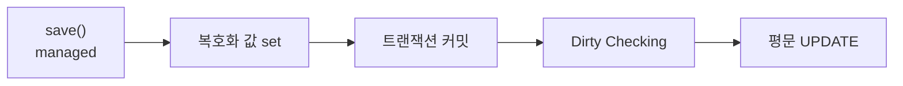
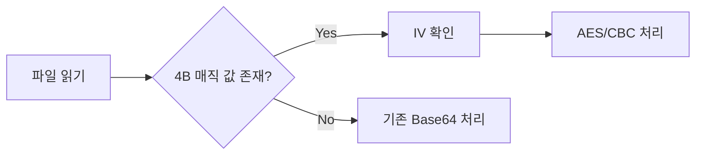
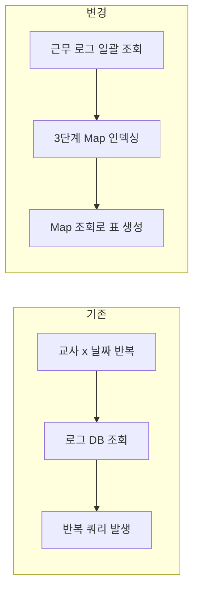
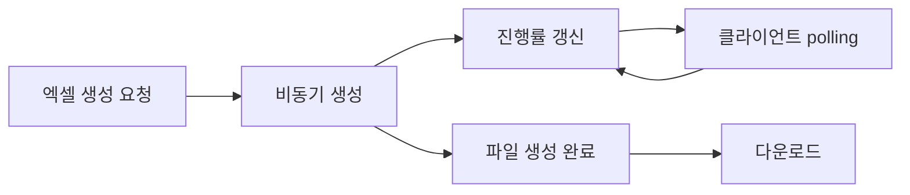
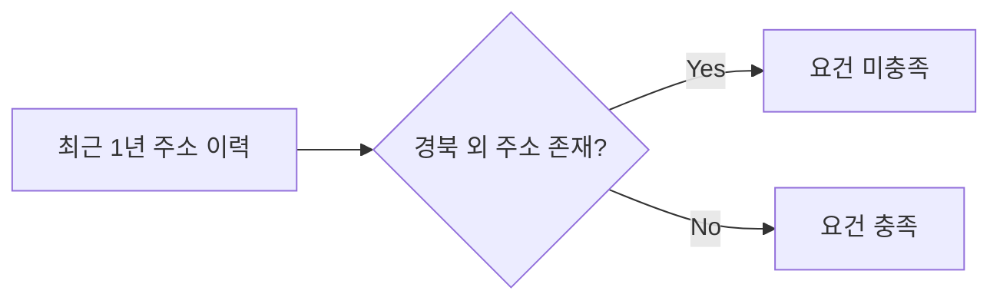

# 모이소 - 경상북도 모바일 도민증

약 20만 명이 사용하는 경상북도 복지 통합 플랫폼입니다. 초기 구축 이후 약 1년간 Flutter 앱, API 서버, 관리자 웹 3개 레포지토리의 기능 고도화, 버그 수정 및 운영을 담당했습니다.

## 프로젝트 개요

| 항목     | 내용                                                         |
| ------ | ---------------------------------------------------------- |
| 기간     | 2024.03 ~ 2025.08                                          |
| 역할     | 초기 구축 이후 약 1년간 단독 고도화 및 운영                                 |
| 기술 스택  | Java 11, Spring Boot 2.6, JPA, Flutter/Dart, MySQL, GitLab |
| 커밋     | 503건, 본인 기준 3개 레포지토리 합산                                    |
| 서비스 규모 | 약 20만 사용자, 복지 서비스 8종 이상                                    |

경상북도청 발주 복지 통합 플랫폼으로, 앱, API 서버, 관리자 웹을 함께 담당하며 개인정보 암호화, 인증/인가, 조회 성능 개선, 외부 데이터 검증, Flutter 클라이언트, 데이터 정합성 관련 작업을 수행했습니다.

---

# 프로젝트 담당 범위

<b>프로젝트 인수 이후 단독 고도화 및 운영</b>

프로젝트 인수 이후 기능 고도화, 버그 수정, 배포, 보안 진단 대응 및 유지보수를 담당했습니다.

Flutter 앱, API 서버, 관리자 웹을 함께 관리했기 때문에 장애 발생 시 클라이언트 요청부터 서버 로직과 DB 상태까지 전체 요청 흐름을 기준으로 원인을 추적하고 수정할 수 있었습니다.

<b>운영 서비스 보안 조치 적용</b>

정기 보안 진단 결과를 실제 운영 중인 서비스에 반영했습니다.

변경 범위를 제한하고 기존 기능에 미치는 영향을 확인한 뒤 단계적으로 수정하는 방식으로 작업했습니다.

운영 환경에서는 기술적으로 가능한 변경 범위뿐 아니라 회귀 위험과 운영 영향도 함께 고려해야 했습니다.

<b>행복선생님 및 통합돌봄 신규 기능 개발</b>

행복선생님과 통합돌봄 기능은 요구사항 정리와 화면 기획부터 구현까지 신규 개발을 수행했습니다.

요구사항의 목적과 실제 업무 흐름을 확인한 뒤 앱, API 서버, 관리자 기능을 함께 구현했습니다.

---

# 주요 기술 사례

## 핵심 사례

<b>JPA Dirty Checking으로 인한 복호화 값 재저장 방지</b> | detach / flush 순서 조정

### 문제

DB 값을 복호화해 반환하는 로직을 구현한 이후 운영 환경에서 두 가지 문제가 발생했습니다.

별도의 `UPDATE` 코드가 없었음에도 암호화 컬럼에 평문이 저장됐고, 일부 요청에서는 이미 복호화된 값을 다시 복호화하면서 예외가 발생했습니다.

### 원인

`save()` 이후 엔티티가 영속성 컨텍스트에서 managed 상태로 유지되고 있었습니다.

이 상태에서 응답을 만들기 위해 복호화 값을 엔티티에 `set`했고, 트랜잭션 커밋 시 Dirty Checking이 수행되면서 변경된 평문 값이 DB에 `UPDATE`됐습니다.

```mermaid
flowchart LR
    A["save()<br/>managed"] --> B["복호화 값 set"]
    B --> C["트랜잭션 커밋"]
    C --> D["Dirty Checking"]
    D --> E["평문 UPDATE"]
```

### 해결

처리 순서를 다음과 같이 변경했습니다.

`save() -> flush() -> detach() -> 복호화 -> 반환`

암호화된 값을 먼저 DB에 반영한 후 엔티티를 영속성 컨텍스트에서 분리하고, 그 이후에만 복호화 값을 설정하도록 수정했습니다.

```mermaid
flowchart LR
    A["암호화 값 저장"] --> B["flush()"]
    B --> C["detach()"]
    C --> D["복호화"]
    D --> E["응답 반환"]
```

### 개선 방향

현재 다시 설계한다면 엔티티 자체를 응답 객체로 사용하지 않고 DTO 변환 과정에서 복호화를 수행할 것입니다.

영속 상태의 엔티티를 조회 결과 표현을 위해 직접 수정한 것이 문제의 원인이었기 때문에, 영속 엔티티와 응답 모델의 책임을 분리하는 방식이 더 적절합니다.

<b>첨부파일 Base64에서 AES/CBC로 점진적 전환</b> | 매직 값 기반 포맷 판별

### 문제

운영 중인 상태에서 수천 건의 기존 첨부파일을 Base64 방식에서 AES/CBC 방식으로 전환해야 했습니다.

기존 파일을 한 번에 모두 변환하면 대량 파일 처리와 장애 복구 부담이 발생할 수 있었습니다.

### 해결

기존 파일과 신규 파일을 일정 기간 함께 처리할 수 있도록 파일 자체에서 포맷을 식별하도록 구성했습니다.

파일 앞부분에 4바이트 매직 값을 추가하고, 해당 값이 존재하면 AES 파일로, 존재하지 않으면 기존 Base64 파일로 처리했습니다.

```mermaid
flowchart LR
    A["파일 읽기"] --> B{"4B 매직 값 존재?"}
    B -- Yes --> C["IV 확인"]
    C --> D["AES/CBC 처리"]
    B -- No --> E["기존 Base64 처리"]
```

별도의 DB 컬럼을 추가하지 않고 파일 자체를 기준으로 포맷을 판단할 수 있었습니다.

암호화는 `CipherOutputStream`과 8KB 버퍼를 사용해 스트리밍 방식으로 처리했습니다.

이전에 대량 엑셀 생성 과정에서 전체 데이터를 한 번에 메모리에 적재해 OOM이 발생한 경험을 반영해 파일 전체를 메모리에 올리지 않도록 구현했습니다.

IV는 파일마다 랜덤으로 생성했습니다.

### 결과

기존 파일을 일괄 마이그레이션하지 않고 신규 파일부터 AES/CBC 방식을 적용하면서 기존 포맷도 계속 지원할 수 있었습니다.

<b>주민등록번호 평문 메모리 잔존 제거</b> | 가변 버퍼 + 즉시 RSA 암호화

### 문제

외부 보안 진단에서 회원가입 과정에 입력된 주민등록번호가 애플리케이션 메모리에 평문으로 남아 있는 문제가 확인됐습니다.

`Frida`와 `fridump3`로 메모리를 덤프한 결과 입력한 주민등록번호를 그대로 확인할 수 있었습니다.

### 원인

처음에는 사용이 끝난 변수에 `null`을 대입하면 해결될 것으로 판단했습니다.

하지만 Dart의 `String`은 immutable이므로 기존 문자열 데이터를 직접 덮어쓸 수 없고, 참조가 제거돼도 해당 객체는 GC 이전까지 메모리에 남아 있을 수 있었습니다.

### 해결

주민등록번호를 `String`으로 유지하지 않고 `List<int>` 형태의 가변 버퍼로 처리했습니다.

사용 직후 `fillRange(0, len, 0)`으로 버퍼를 0으로 덮어쓰고, 입력 직후 RSA 암호화를 수행해 이후에는 암호문만 사용하도록 흐름을 변경했습니다.

공개키는 암호화 직전에 서버에서 조회했습니다.

```mermaid
flowchart LR
    A["주민번호 입력"] --> B["가변 버퍼 저장"]
    B --> C["서버 공개키 조회"]
    C --> D["RSA 암호화"]
    D --> E["평문 버퍼 0으로 덮어쓰기"]
    E --> F["암호문 전송"]
```

### 검증

수정 후 동일한 방식으로 메모리 덤프를 수행했고, 재진단에서 해당 항목의 조치 완료를 확인했습니다.

<b>근무상황표 조회 N+1 제거</b> | 일괄 조회 + 요청 단위 Map 인덱싱, 10초 이상에서 0.5초 이내

### 문제

근무상황표를 한 달 범위로 조회할 때 응답 시간이 10초 이상 소요됐습니다.

초기에는 개별 SQL의 실행 시간이 긴 것으로 판단했지만, 확인 결과 교사와 날짜가 증가할수록 조회 쿼리가 반복적으로 실행되는 N+1 문제가 주요 원인이었습니다.

### 해결

각 쿼리에 인덱스를 추가해 개별 실행 시간을 줄이는 대신, DB 조회 횟수 자체를 줄이는 방향으로 변경했습니다.

조회 범위의 근무 로그를 한 번에 조회한 뒤 다음 구조로 메모리에 인덱싱했습니다.

`Map<teacherIdx, Map<날짜, Map<type, Log>>>`

이후 반복문에서는 DB를 다시 조회하지 않고 Map에서 필요한 로그를 조회하도록 수정했습니다.

조회 범위가 지나치게 커지지 않도록 날짜와 교사를 기준으로 2단계 페이징을 적용했습니다.

```mermaid
flowchart LR
    subgraph BEFORE["기존"]
        A["교사 x 날짜 반복"] --> B["로그 DB 조회"]
        B --> C["반복 쿼리 발생"]
    end

    subgraph AFTER["변경"]
        D["근무 로그 일괄 조회"] --> E["3단계 Map 인덱싱"]
        E --> F["Map 조회로 표 생성"]
    end
```

### 결과

기존 10초 이상 소요되던 조회 시간을 0.5초 이내로 줄였습니다.

### 한계

이때 사용한 Map은 여러 요청에서 재사용되는 캐시가 아니라 요청 처리 중 반복 DB 조회를 제거하기 위한 임시 인덱스입니다.

동일한 월의 근무상황표가 다시 요청되더라도 DB 조회, Map 생성, 근무상황표 계산을 다시 수행합니다.

Map 구성과 계산도 요청 스레드에서 수행되기 때문에 데이터 규모가 증가하면 애플리케이션 CPU와 Heap 사용량에도 영향을 줄 수 있습니다.

당시에는 소규모 인력이 앱, API 서버, 관리자 웹과 운영 환경을 함께 관리하고 있었고, 별도 인프라 도입으로 운영 복잡도를 높이는 것을 지양하는 환경이었습니다.

따라서 Redis와 같은 별도의 외부 캐시를 추가하지 않고 애플리케이션 내부에서 N+1을 제거하는 수준으로 구현 범위를 제한했습니다.

### 개선 방향

현재 다시 설계한다면 먼저 실제 조회 빈도, 동일 조건의 반복 요청 비율, 데이터 변경 빈도를 측정할 것입니다.

동일한 월의 근무상황표가 반복적으로 조회되고 데이터 변경 빈도가 상대적으로 낮다면 외부 캐시 적용을 검토할 수 있습니다.

```mermaid
flowchart LR
    A["근무상황표 요청"] --> B{"캐시 조회"}
    B -- HIT --> C["캐시 결과 반환"]
    B -- MISS --> D["DB 일괄 조회"]
    D --> E["근무상황표 계산"]
    E --> F["캐시 저장"]
    F --> C
```

캐시를 적용할 경우 TTL뿐 아니라 근무 로그 변경 시 어떤 캐시 키를 무효화할지까지 함께 설계해야 합니다.

반대로 캐시 적중률이 낮다면 별도 캐시 인프라를 추가하지 않고 현재와 같은 일괄 조회 구조를 유지하는 것이 더 적절할 수 있습니다.

<b>전체 REST 엔드포인트 역할 기반 인가 적용</b>

### 문제

다수의 REST 엔드포인트에서 로그인 여부인 `isLogin`만 확인하고 요청을 처리하고 있었습니다.

인증된 사용자라고 해서 모든 기능에 접근할 수 있는 것은 아니지만 역할에 따른 인가 처리가 누락된 엔드포인트가 존재했습니다.

### 해결

전체 REST 엔드포인트에 `sessionUser.isLoginRole(url)` 검증을 적용해 사용자 역할과 요청 URL을 기준으로 접근 권한을 검사하도록 수정했습니다.

### 한계

URL 문자열을 기준으로 권한을 판단하는 방식이라 URL이 변경되면 권한 로직도 함께 수정해야 합니다.

### 개선 방향

현재 다시 설계한다면 `@PreAuthorize` 등을 사용해 메서드 단위로 권한 정책을 관리하고, 리소스 소유권처럼 도메인 데이터 확인이 필요한 인가는 별도의 인가 로직으로 분리할 것입니다.

---

## 추가 수행 내용

### 개인정보 보호 / 암호화

<b>RSA 키 생성 비용 제거</b> | 요청 단위 키 생성에서 애플리케이션 기동 시 생성으로 변경

주민등록번호 RSA 암호화 초기 구현에서는 요청이 들어올 때마다 키쌍을 생성했습니다.

RSA 키 생성은 비용이 큰 작업이고 요청 단위로 반복할 필요가 없다고 판단해 `@PostConstruct`에서 서버 시작 시 한 번 생성하는 `RsaKeyProvider`를 구성했습니다.

앱에서는 `/user/get/pubkey` API를 호출해 공개키를 받아 암호화했습니다.

다만 서버가 재시작되면 새로운 키쌍이 생성되므로 이전 공개키로 암호화된 요청을 복호화하지 못할 수 있습니다.

현재 다시 설계한다면 `kid`를 사용해 키 버전을 구분하고 이전 키를 일정 기간 유지하는 키 로테이션 구조를 함께 적용할 것입니다.

<b>SQLite AES-256 암호화</b> | 기기별 암호화 키 관리

앱에서 민감정보를 SQLite에 저장하고 있어 기기 분실이나 루팅 환경에서 DB 파일이 노출될 가능성이 있었습니다.

SQLCipher를 적용해 SQLite 데이터베이스 자체를 AES-256으로 암호화했습니다.

모든 기기에서 동일한 키를 사용할 경우 하나의 키가 노출됐을 때 전체 기기의 DB가 영향을 받을 수 있기 때문에 기기마다 별도의 랜덤 키를 생성했습니다.

키는 iOS Keychain과 Android `EncryptedSharedPreferences`에 저장했습니다.

기존에 저장된 평문 DB는 앱 최초 실행 시 암호화된 DB로 이전하도록 마이그레이션했습니다.

<b>개인정보 전송 범위 최소화</b> | encRrn 중심 전송 + 평문 로그 제거

일부 API 요청에 평문 주민등록번호가 포함되는 구간이 있었습니다.

평문 개인정보가 네트워크나 서버 로그에 남을 가능성을 줄이기 위해 일반 요청에서는 `rrn` 대신 `encRrn`만 전달하도록 변경했습니다.

평문 주민등록번호가 실제로 필요한 기능은 `getRrn()`으로 분리했고, 디버깅 과정에서 주민등록번호를 출력하던 로그도 함께 제거했습니다.

### 인증 / 인가 / 보안 진단

<b>첨부파일 접근 제어</b> | target 기준 역할 매핑 + 리소스 소유권 검증

첨부파일은 기능마다 접근할 수 있는 역할이 달랐습니다.

`Attach.target`을 기준으로 접근 가능한 역할을 `static final Map`으로 정의하고 첨부파일 조회 시 공통으로 권한을 확인하도록 구성했습니다.

엑셀 파일은 일반 첨부파일과 다르게 생성한 관리자 `adminIdx` 또는 도청 `ADMIN`만 접근할 수 있도록 별도로 검사했습니다.

단순 역할 확인뿐 아니라 첨부파일 대상과 현재 사용자의 관계까지 확인해야 하는 경우에는 도메인 데이터를 기준으로 접근 권한을 검사했습니다.

<b>로그인 비밀번호 RSA 전처리</b> | 기존 Spring Security 인증 흐름 유지

로그인 비밀번호를 평문으로 전송하지 않도록 RSA 암호화를 적용했습니다.

프론트엔드에서 서버 공개키를 받아 `JSEncrypt`로 비밀번호를 암호화하고, 서버에서는 `PasswordPreprocessingFilter`에서 복호화했습니다.

기존 Spring Security 인증과 BCrypt 처리 흐름을 유지하기 위해 인증 필터보다 먼저 요청을 가로채 비밀번호를 복호화하고 `HttpServletRequestWrapper`로 요청 값을 교체했습니다.

```mermaid
flowchart LR
    A["로그인 입력"] --> B["RSA 암호화"]
    B --> C["PasswordPreprocessingFilter"]
    C --> D["RSA 복호화"]
    D --> E["Spring Security 인증"]
    E --> F["BCrypt 검증"]
```

<b>정기 보안 진단 조치</b> | 예외 처리, XSS, 로깅, 권한 검증

정기적으로 수행되는 보안 및 시큐어코딩 진단 결과를 운영 서비스에 반영했습니다.

* XSS 입력 필터 적용
* `catch(Exception)` 형태의 포괄적 예외 처리 세분화
* `printStackTrace()` 제거 및 로거 적용
* I/O 처리에 `try-with-resources` 적용
* 권한 확인 없이 `userIdx`만 전달받아 동작하던 알림 API 제거

운영 중인 서비스였기 때문에 광범위한 리팩토링보다 진단 대상 범위를 중심으로 수정하고 기존 기능에 미치는 영향을 확인하면서 적용했습니다.

### 성능 / 확장성

<b>집계 쿼리 인덱스 활용 개선</b> | 컬럼 함수 및 불필요한 LIKE 제거

대시보드와 농어민수당 집계 쿼리의 실행 시간이 길었습니다.

확인 결과 `date_format(create_date, ...)`처럼 인덱스 대상 컬럼에 함수를 적용하거나 `LIKE '%2025%'`와 같은 조건을 사용하고 있었습니다.

연도 조건을 별도 컬럼인 `create_year = :year`로 변경하고 불필요한 `LIKE` 조건을 제거했습니다.

조회 빈도가 낮고 실행 비용이 큰 차트는 페이지 진입 시 바로 조회하지 않고 사용자가 선택했을 때 조회하도록 변경했습니다.

<b>대량 엑셀 생성 스트리밍 처리</b> | SXSSF + 비동기 처리 + 진행률 polling

대량 엑셀 생성 과정에서 전체 데이터를 한 번에 메모리에 적재하면서 OOM이 발생했습니다.

SXSSF를 적용해 일정 범위의 행만 메모리에 유지하면서 엑셀 파일을 생성하도록 변경했습니다.

엑셀 생성 작업은 비동기로 처리하고 클라이언트에서 polling 방식으로 진행률을 조회하도록 구성했습니다.

```mermaid
flowchart LR
    A["엑셀 생성 요청"] --> B["비동기 생성"]
    B --> C["진행률 갱신"]
    C --> D["클라이언트 polling"]
    D --> C
    B --> E["파일 생성 완료"]
    E --> F["다운로드"]
```

진행률은 애플리케이션 내부 `HashMap`에 저장했습니다.

단일 인스턴스에서는 동작하지만 여러 인스턴스로 확장할 경우 각 서버가 서로 다른 상태를 갖게 됩니다.

다중 인스턴스 환경을 고려한다면 Redis나 DB 작업 테이블과 같은 공유 저장소로 작업 상태를 분리할 필요가 있습니다.

### 외부 데이터 / 현장 검증

<b>농어민수당 거주 이력 검증</b> | 최근 1년 전체 주소 이력 기준 적용

기존에는 마지막 전입일부터 1년 이상 경북에 거주했는지만 확인했습니다.

이 방식에서는 경북에 거주하다 다른 지역으로 이동한 뒤 다시 경북으로 돌아온 사용자도 조건을 통과할 수 있었습니다.

마이데이터에서 전달받은 주소 이력을 최근 기록부터 확인해 최근 1년 안에 경북 외 주소가 한 번이라도 존재하면 요건을 충족하지 않는 것으로 처리했습니다.

```mermaid
flowchart LR
    A["최근 1년 주소 이력"] --> B{"경북 외 주소 존재?"}
    B -- Yes --> C["요건 미충족"]
    B -- No --> D["요건 충족"]
```

행정기관에서 전달받은 XML 데이터에는 태그가 없거나 값이 비어 있는 경우도 있어 파싱 과정에서 `null`을 고려하도록 수정했습니다.

<b>현장 GPS 검증</b> | 플랫폼별 위치 권한 및 정확도 처리

현장에서 QR을 촬영할 때 실제 위치가 허용 범위 안에 있는지 검증하는 기능을 구현했습니다.

플랫폼과 위치 권한에 따라 전달되는 위치 정확도가 달랐고, iOS에서는 `unableToDetermine`과 같은 별도 상태도 반환됐습니다.

플랫폼별 허용 권한과 오류 상태를 분리해 처리하고 실제 현장에서 위치 정확도를 측정해 허용 반경을 설정했습니다.

저장된 사진이나 외부 카메라로 촬영한 이미지를 재사용하는 우회를 제한하기 위해 앱 내부 카메라에서 실시간으로 인식한 QR만 처리하도록 구성했습니다.

<b>QR 경로당 식별</b> | 위경도 대신 qrcodeIdx 사용

원본 문서에서는 이 항목의 본문이 `현장 GPS 검증` 내용과 동일하게 중복되어 있어 실제 변경 내용이 확인되지 않습니다.

실제 구현 내용을 확인한 뒤 보완이 필요한 항목입니다.

<b>사용자 식별자 변경</b> | userIdx에서 본인인증 식별값 기준으로 변경

초기에는 `userIdx`를 기준으로 사용자 이력을 조회했습니다.

앱 재설치나 기기 변경 과정에서 사용자 식별값이 변경돼 기존 이력과 연결되지 않는 문제가 있었습니다.

본인인증 시점부터 보유하고 있는 암호화된 주민등록번호를 기준으로 사용자를 식별하도록 변경했습니다.

DB 내부 PK와 비즈니스에서 동일 사용자를 식별하는 기준은 구분해서 설계할 필요가 있다는 점을 확인했습니다.

### Flutter 클라이언트

<b>JWT 만료 사전 감지 및 자동 재발급</b> | NavigatorObserver 기반 처리

JWT가 만료된 상태에서 API를 호출하면 HTTP 401이 발생하면서 화면이 정상적으로 동작하지 않는 문제가 있었습니다.

`NavigatorObserver`를 전역으로 등록해 화면이 전환될 때마다 JWT의 `exp`를 확인하고, 만료가 임박하면 새로운 토큰을 발급받도록 구성했습니다.

재발급 요청이 동시에 여러 번 발생하지 않도록 `isRefreshingToken`으로 중복 요청을 제한하고 `retryCount`에도 제한을 적용했습니다.

토큰 재발급 직후 `pushReplacementNamed`를 바로 호출하면 화면 전환 과정과 충돌하는 문제가 있어 `Future.microtask`를 사용해 다음 이벤트 루프에서 실행하도록 수정했습니다.

<b>이미지 업로드 실패 보상 처리</b> | 2단계 요청 실패 시 선행 데이터 삭제

결과 데이터를 먼저 생성한 뒤 이미지를 업로드하는 2단계 구조에서 이미지 업로드가 실패하면 결과 데이터만 DB에 남는 문제가 있었습니다.

이미지 업로드 실패 시 `/APP/happy/result/fail` API를 호출해 앞에서 생성한 결과 데이터를 삭제하도록 구현했습니다.

```mermaid
flowchart LR
    A["결과 데이터 생성"] --> B["이미지 업로드"]
    B --> C{"업로드 성공?"}
    C -- Yes --> D["처리 완료"]
    C -- No --> E["fail API 호출"]
    E --> F["결과 데이터 삭제"]
```

두 작업을 하나의 DB 트랜잭션으로 처리할 수 없는 구조라 보상 트랜잭션으로 처리했습니다.

현재 다시 설계한다면 결과 데이터 생성과 이미지 처리를 하나의 서버 작업 경계로 묶을 수 있는 구조를 우선 검토할 것입니다.

<b>사용자 상태 저장 위치 변경</b> | 전역 객체 대신 SharedPreferences 사용

화면을 이동한 뒤 전역 객체인 `GV.userData.user`가 초기화되면서 `userIdx` 등의 값이 `null`이 되는 문제가 발생했습니다.

전역 객체에 의존하지 않고 `SharedPreferences`에 저장된 값을 기준으로 사용자 정보를 조회하도록 변경했습니다.

런타임 중 초기화될 수 있는 전역 객체를 지속적으로 유지돼야 하는 사용자 정보의 기준 저장소로 사용하지 않도록 수정했습니다.

<b>외국인 등록번호 체크섬 분리</b>

내국인 주민등록번호와 외국인 등록번호는 비슷한 형식을 가지고 있지만 체크섬 계산 방식에 차이가 있었습니다.

성별 코드가 1, 2인 경우와 5, 6인 경우를 구분해 각각 다른 검증 로직을 적용했습니다.

데이터 형식이 유사하더라도 규격이 다르면 별도의 검증 로직으로 처리하도록 분리했습니다.

### 데이터 정합성 / 설계 판단

<b>CI null 덮어쓰기 수정</b> | 요청 객체와 DB 객체 구분

원본 문서에서는 이 항목의 본문이 `외국인 등록번호 체크섬` 내용과 동일하게 중복되어 있어 실제 구현 내용을 확인할 수 없습니다.

실제 수정 내용을 확인한 뒤 보완이 필요한 항목입니다.

<b>탈퇴 교사 이력 보존</b>

원본 문서에서는 이 항목의 본문이 `외국인 등록번호 체크섬` 내용과 동일하게 중복되어 있어 실제 구현 내용을 확인할 수 없습니다.

실제 처리 방식 확인 후 보완이 필요한 항목입니다.

<b>신청 시점 거주지 스냅샷</b>

원본 문서에서는 이 항목의 본문이 `외국인 등록번호 체크섬` 내용과 동일하게 중복되어 있어 실제 구현 내용을 확인할 수 없습니다.

실제 구현 내용을 확인한 뒤 보완이 필요한 항목입니다.

<b>암호화 파일 포맷 식별 방식</b> | DB 상태 컬럼 대신 파일 헤더 사용

운영 중 이미 수천 건의 파일이 저장된 상태에서 기존 Base64 파일을 AES/CBC 파일로 전환해야 했습니다.

DB에 `is_encrypted`와 같은 컬럼을 추가할 경우 기존 데이터에 대한 마이그레이션이 필요하고, DB 상태와 실제 파일 상태가 불일치할 가능성도 있었습니다.

파일 헤더에 4바이트 매직 값을 추가하고 해당 값을 기준으로 암호화 포맷을 판별하도록 설계했습니다.

파일 자체를 기준으로 포맷을 식별하므로 DB 스키마를 변경하지 않고 기존 포맷과 신규 포맷을 함께 지원할 수 있었습니다.

<b>시군 단위 데이터 접근 제한</b> | DB 조회 단계에서 area_code 필터 적용

시군별로 접근할 수 있는 데이터를 제한해야 했습니다.

애플리케이션에서 전체 데이터를 조회한 뒤 시군 조건으로 필터링하면 권한 범위를 벗어난 데이터까지 애플리케이션 계층으로 조회되고, 필터가 누락될 경우 데이터가 노출될 가능성이 있었습니다.

관련 테이블에 `area_code`를 추가하고 SQL 조회 조건 자체에 담당 시군 조건을 포함했습니다.

```mermaid
flowchart LR
    A["사용자 요청"] --> B["담당 area_code 확인"]
    B --> C["WHERE area_code = ?"]
    C --> D["허용 범위 데이터 조회"]
    D --> E["응답"]
```

애플리케이션에서 사후 필터링하지 않고 DB 조회 단계에서부터 접근 가능한 데이터 범위를 제한했습니다.

---

# 기술적 한계 및 개선 방향

<b>인가 정책을 초기 설계에 포함하지 못함</b>

초기 개발에서는 인증을 구현했지만 일부 기능의 인가 정책을 함께 정의하지 못했습니다.

이후 전체 REST 엔드포인트를 다시 점검하면서 역할 기반 접근 제어를 추가했습니다.

기능 구현 이후 권한을 추가하면 누락 가능성이 발생하므로 기능 설계 단계에서 인증 여부, 허용 역할, 리소스 소유권, 담당 지역 등을 함께 정의할 필요가 있었습니다.

<b>근무상황표 계산 결과를 요청 간 재사용하지 못함</b>

N+1을 제거하면서 요청 단위로 근무 로그를 일괄 조회하고 Map으로 인덱싱했습니다.

DB 조회 횟수는 크게 줄였지만 동일한 조회가 반복돼도 매 요청마다 DB 조회와 Map 생성을 다시 수행했습니다.

당시에는 소규모 인력이 운영 환경 전체를 관리하고 있어 별도의 캐시 인프라를 추가하면서 발생하는 운영 복잡도를 고려해 요청 단위 처리로 제한했습니다.

현재 다시 설계한다면 조회 빈도, 반복 요청 비율, 데이터 변경 주기를 측정한 뒤 Redis 등의 외부 캐시 적용 여부를 결정할 것입니다.

캐시를 적용한다면 TTL뿐 아니라 데이터 변경 시 어떤 범위의 캐시를 무효화할지도 함께 설계해야 합니다.

<b>엑셀 진행률을 애플리케이션 내부 HashMap으로 관리함</b>

비동기 엑셀 생성 작업의 진행률을 애플리케이션 내부 `HashMap`에 저장했습니다.

단일 서버에서는 문제가 없지만 여러 인스턴스로 확장하면 각 서버가 서로 다른 진행률 상태를 갖게 됩니다.

당시에는 단일 서버 환경을 기준으로 구현했지만 다중 인스턴스를 고려한다면 Redis나 DB 작업 테이블 같은 공유 저장소로 상태를 분리할 필요가 있습니다.

<b>대량 데이터 처리 전에 메모리 사용량을 충분히 검토하지 못함</b>

초기 엑셀 생성에서는 데이터를 한 번에 메모리에 적재했습니다.

데이터 규모가 증가하면서 OOM이 발생한 이후 SXSSF 기반 스트리밍 처리로 변경했습니다.

대량 데이터를 처리하는 기능에서는 구현 전에 예상 데이터 건수, 메모리 적재량, 중간 객체 생성량과 스트리밍 처리 가능 여부를 먼저 검토할 필요가 있었습니다.

<b>외부 데이터가 정상적으로 전달된다고 가정함</b>

행정기관 XML 데이터를 처리하면서 값이 항상 존재한다고 가정했고, 초기 구현에서 `null` 처리가 누락돼 NPE가 발생했습니다.

외부 시스템의 데이터는 명세상 필수 항목이라도 실제 응답에서 태그가 누락되거나 빈 값이 전달될 수 있다는 전제로 처리해야 했습니다.

<b>Spring Boot 버전 업그레이드를 장기간 미룸</b>

서비스 안정성을 이유로 Spring Boot 2.6을 장기간 유지했습니다.

프로젝트 인수 직후 업그레이드를 진행했다면 변경해야 할 코드와 영향 범위가 상대적으로 작았겠지만, 기능과 의존성이 추가되면서 이후 업그레이드 비용이 증가했습니다.

프레임워크 버전 업그레이드는 장기간 미루기보다 일정 주기로 기술 부채 항목에 포함해 검토하는 것이 적절했다고 판단합니다.

