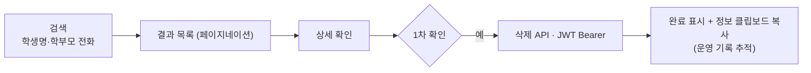

# tomas — 입시 상담 예약 서비스

> 학원 입시 상담을 예약하고, 상담사·분석가·관리자가 각 역할에 맞게 처리하는 시스템입니다. 입사 초기에 맡은 프로젝트로 관리자·콘텐츠 기능을 담당하면서, 보안 버그 수정·도메인 모델링·**운영 관리 도구 자체 개발**까지 다뤘습니다.

## 한눈에

| 항목 | 내용 |
|---|---|
| 기간 | 2024.05 ~ 2024.09 |
| 역할 | 팀(3인) — 관리자·콘텐츠 기능 (+ 운영 관리 도구 자체 개발) |
| 스택 | Spring Boot 3.2 · Java 21 · Spring Security · JPA · Thymeleaf · MySQL / Flutter(관리 도구) |
| 커밋 | 65 (본인 기준) |

기능이 대체로 구현된 상태에서 관리자·콘텐츠 영역의 마무리와 운영을 맡았습니다. 실무에서 Spring과 웹 개발의 기본기를 익혀 나가던 시기지만, 보안 버그를 알고리즘 수준까지 파고들고, 운영 중 터진 문제를 별도 도구로 풀어낸 경험들이 이때 쌓였습니다.

---

## 1. 보안·인증

### BCrypt 해시 검증 정규식 수정 (SHA-256→BCrypt)

비밀번호 처리를 손보다, "이미 암호화된 값인지" 판별하는 가드가 **SHA-256 기준**인데 시스템은 실제로 **BCrypt**를 쓰고 있는 불일치를 발견했습니다. 이 상태면 암호화 여부 판단이 틀려 이중 암호화나 검증 실패로 이어집니다. BCrypt 형식 정규식(`^\$2[ayb]\$\d{2}\$[./A-Za-z0-9]{53}$`)으로 판별하도록 고쳤습니다. 알고리즘을 바꿀 땐 그에 딸린 체크 로직까지 함께 맞춰야 한다는 걸 배웠습니다.

### UserDetailsService null 처리 (UsernameNotFoundException)

관리자 아이디가 틀리면 `loadUserByUsername()`이 `null` 사용자로 `getPassword()`를 호출해 NPE가 났습니다. Spring Security의 계약대로 **사용자를 못 찾으면 `UsernameNotFoundException`을 throw**하도록 바꿨습니다 — 그래야 Security가 "잘못된 자격증명"으로 변환해 정상적인 로그인 실패 응답을 냅니다.

### 상담 완료 상태 폼 잠금 (isEditable 단일 메서드)

상담이 완료(`status == 5`)되면 학생이 신청 폼을 더 못 고치게 막아야 했습니다. 편집 가능 여부 판단을 `isEditable()` **단일 메서드에 모아** 상태 조건을 한 곳에서 관리했습니다(상태값을 Enum으로 뒀으면 `5` 같은 매직 넘버는 피했을 것입니다).

---

## 2. JPA 기본값 적용 — @DynamicInsert + columnDefinition

엔티티에 `columnDefinition`으로 DB 기본값을 명시했는데도 기본값이 안 먹는 경우가 있었습니다. Hibernate가 `INSERT` 시 **모든 컬럼을 포함**해 쿼리를 만들면 null이 그대로 들어가 DB 기본값이 무시되기 때문입니다.

`@DynamicInsert`/`@DynamicUpdate`를 붙여 null 필드를 쿼리에서 빼 DB 기본값이 적용되게 하고, 동시에 **Java 필드 기본값(`= 1` 등)도 함께 둬 이중으로 방어**했습니다. 또 JPA 엔티티에 잘못 붙어 있던 `@DateTimeFormat`(폼 바인딩용)을 제거하고 영속화 시점은 `@CreationTimestamp`로 분리했습니다 — 둘은 역할이 다릅니다. 상태 코드는 `statusText()` 같은 도메인 메서드로 변환을 캡슐화해 컨트롤러·템플릿을 단순하게 유지했습니다.

---

## 3. 공지 게시판 — is_notice/place_order 정렬, 수직 구현

`board`/`post` 도메인 설계부터 REST API·컨트롤러·AJAX JS·Thymeleaf 템플릿까지 한 흐름으로 만들었습니다. 관리자가 공지 순서를 직접 제어해야 해서, 등록일 정렬만으로는 부족했습니다. **고정 공지(`is_notice`) + 순서값(`place_order`)** 두 컬럼 조합으로 풀고, 공지글과 일반글을 분리 조회했습니다(정렬 의도가 명확해지고 인덱스 활용에도 유리합니다). 정렬 기준을 데이터로 관리하는 방식을 이때 처음 다뤘습니다. 콘텐츠 작성은 TinyMCE WYSIWYG 에디터를 통합하되 한국어 언어팩까지 챙기고, 초기화 로직을 별도 래퍼 파일로 분리해 재사용 가능하게 했습니다.

---

## 4. tomas_assist — hard delete 운영 대응 관리 도구 자체 개발

운영 중 목록 화면에서 NullPointerException이 나 **화면 전체가 깨지는** 일이 있었습니다. 원인은 hard delete로 인한 참조 무결성 위반 — 참조하던 데이터가 사라져 NPE가 난 것이었습니다.

팀 논의 결과, 자동 삭제 기능을 넣기보다 **"고객 요청 → 문제 여부 판단 → 수동 삭제"**로 가기로 했고, 제가 관리자 역할로 삭제를 책임지게 됐습니다. 매번 DB에 직접 쿼리하는 게 번거로워서, **언제든 안전하게 처리할 수 있는 Flutter 관리 도구 앱을 별도로 직접 만들었습니다.**

되돌릴 수 없는 작업이라 **2단계 확인**을 두고, 삭제 후엔 학생·학부모 정보를 클립보드로 남겨 **나중에 추적**할 수 있게 했습니다. 규모는 작지만, 운영에서 실제로 터진 문제를 적절한 도구로 풀어낸 경험입니다. (토큰을 상수로 박은 건 한계였습니다 — 로그인→저장→갱신 사이클로 갔어야 했습니다.)

---

## 잘 됐던 것

**보안 버그를 알고리즘 수준까지 파고들었습니다.** 제가 만든 코드가 아니어도, 암호화 체크가 실제 알고리즘과 어긋난 걸 그냥 넘기지 않고 근본 원인까지 고쳤습니다.

**운영 문제를 자발적으로 도구화했습니다.** NPE로 화면이 깨지는 문제를 임시방편이 아니라, 안전한 수동 삭제 워크플로우를 갖춘 별도 앱으로 풀었습니다.

이 시기에 굳은 "원인을 끝까지 추적하고, 변경 전 전체 흐름을 먼저 본다"는 습관이, 이후 모이소처럼 더 큰 서비스를 단독으로 맡을 때 그대로 이어졌습니다.

---

## 아쉬운 것 · 다음엔 다르게

**상태 코드를 Enum으로 관리했어야 했습니다.** `status == 5`(상담완료) 같은 매직 넘버가 코드에 흩어졌습니다. 상태 체계는 Enum/상수로 묶어야 의미가 드러나고 변경 추적이 쉽습니다.

**관리 도구의 토큰을 하드코딩했습니다.** `tomas_assist`에서 JWT를 상수로 박아 만료 시 재배포가 필요한 구조였습니다. 로그인→저장(secure storage)→갱신 사이클로 갔어야 했습니다.

**초기엔 전체 도메인 흐름 파악이 부족했습니다.** 맡은 기능 중심으로 빠르게 처리하느라 전체 구조를 충분히 보지 못한 채 작업한 부분이 있었습니다. 이 아쉬움이 이후 "기능보다 전체 흐름을 먼저 파악하는" 습관으로 이어졌습니다.
